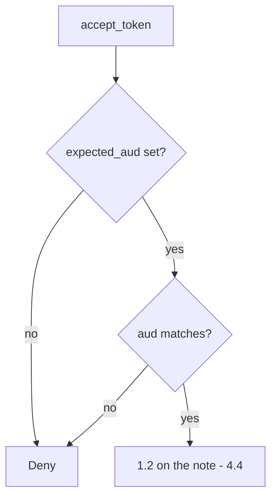

# 4.5-LO-04 — Require the expected audience before 1.2

**Kind:** design-exercise
**Loop step:** 4 Build
**Standards:** OWASP ASVS 5.0.0 (final) `v5.0.0-10.3.1`; RFC 9700 (final).

## Structural means the resource server names itself

`accept_token` must compare `aud` to `expected_aud`. Missing `aud` is deny. A list may contain the expected name; it must not succeed because `sub` exists. Structural means the audience is mediated — not “we use JWTs,” not Authlib defaults, not HTTPS.

## Mental model: name match, then authorization



Fail-safe: empty expected audience, missing claim, or mismatch is **deny**.

## Why this restores the cell

| After the fix | Must be true |
|---|---|
| aud=securecollab-api | allow (then 1.2) |
| aud=other-api | deny |
| missing aud | deny |

## What this is not

ID-token `aud`==`client_id` (`v5.0.0-10.5.4`) is a different check. PKCE. DPoP (`v5.0.0-10.3.5` Level 3 advanced). 4.4 object grants.

## Practice

Name expected audience and predicate. Run:

```
python3 -m pytest labs/4.5/4.5-lab/tests --impl fixed
```

Must pass.

## Transfer

Clinic FHIR resource server with a hospital-specific `aud`.

## Residual risk

Signature, `iss`, `exp`, PKCE, mix-up, sender-constraining, 4.1 leftover tokens.
