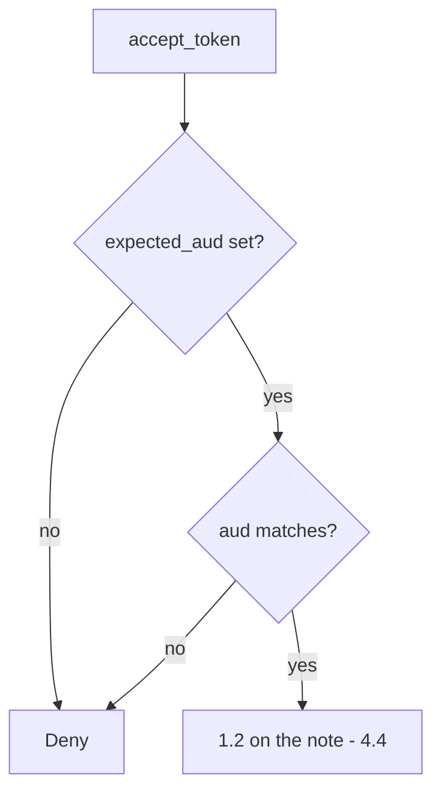

# 4.5-LO-04 — Require the expected audience before 1.2

**Kind:** design-exercise
**Loop step:** 4 Build
**Standards:** OWASP ASVS 5.0.0 (final) `v5.0.0-10.3.1`; RFC 9700 (final). `v5.0.0-10.3.5` (DPoP / mTLS) is **Level 3, advanced**. OAuth 2.1 remains **draft**.

## Structural means the resource server names itself

`accept_token` must compare `aud` to `expected_aud`. Missing `aud` is deny. A list may contain the expected name; it must not succeed because `sub` exists. Structural means the audience is mediated — not “we use JWTs,” not Authlib defaults, not HTTPS, not “OIDC is on.”

The smallest restore for SecureCollab Phase 1 token acceptance is: empty expected audience, missing claim, or mismatch is **deny**. Then 1.2 on the note (4.4). ID-token `aud`==`client_id` (`v5.0.0-10.5.4`) is a different check.

## Mental model: name match, then authorization



The lab’s fixed tree compares `aud` (string or list membership) to `expected_aud`. PKCE, `state`, `nonce`, JWKS, `iss`, and DPoP are named residuals — they are not proven by this fixture. RFC 10017 (browser apps) and RFC 8252 (native apps) name client-shape holes; this pytest is the resource-server `aud` check only.

ASVS `v5.0.0-10.3.1` (Level 2) wants tokens intended for that service. This pytest is that sentence for `securecollab-api`.

## Why this restores the cell

| After the fix | Must be true |
|---|---|
| aud=securecollab-api | allow (then 1.2) |
| aud=other-api | deny |
| missing aud | deny |

## What this is not

ID-token `aud`==`client_id`. PKCE. DPoP (`v5.0.0-10.3.5` Level 3 advanced). 4.4 object grants. OAuth 2.1 as a final standard. Auth0 dashboard green.

## Mechanism limits

- Correct `aud` still needs 1.2 on the note (4.4).
- Empty `aud`; array tricks; `alg=none` — reject unknown alg; do not treat this lesson as a payload catalogue.
- PKCE, `state`, `nonce`, `iss`, JWKS, sender-constraining remain out of the fixture.
- 4.1 leftover tokens after client deprovision.
- Browser SPA holding the access token is `v5.0.0-10.1.1` (BFF residual).

## Practice

Name expected audience and predicate (`aud` matches, else deny). Run:

```text
python3 -m pytest labs/4.5/4.5-lab/tests --impl fixed
```

Must pass.

## Transfer

Clinic FHIR resource server with a hospital-specific `aud`. Native redirect (8.3, RFC 8252) is a residual, not this pytest.

## Residual risk

Signature, `iss`, `exp`, PKCE, mix-up, sender-constraining, 4.1 leftover tokens, 4.4 object grants.

## Non-goals

Do not connect a live IdP. Do not present OAuth 2.1 as final.
