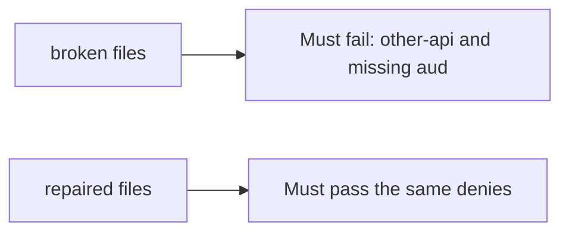

# A token for another API, or a missing audience, must fail

**Kind:** verification-lab
**Loop step:** 5 Verify

## If you cannot test it, it is still a slogan

“OpenID Connect is configured” is not this topic’s evidence. “The JWT verifies” is a tool observation. The check is: `accept_token({"sub": "alice", "aud": "other-api"}, "securecollab-api")` is false. That observation must be **false** on the broken files (returns true) and **true** on the repaired files.

## Picture: other-api and missing aud must fail

A test that only asserts a library called `verify` can pass while a wrong-audience token still counts as a session. This check asks whether a token for another API still counts as a passing control. Broken must fail that question. Repaired must pass it.



| Mode | Must show for this topic |
|---|---|
| Normal | expected `aud` is true (may pass on both) |
| Wrong input / abuse | `aud=other-api` and missing `aud` are false; broken files must fail |
| Not claimed | PKCE; JWKS; DPoP; who-is-allowed on notes |

Lab tests in `labs/4.5/4.5-lab/tests/test_property.py`. `test_wrong_audience_is_rejected` is a **what-must-not-happen** test: a wrong-audience token accepted as a session is not allowed to count as a passing control.

```text
python3 -m pytest labs/4.5/4.5-lab/tests --impl vulnerable
python3 -m pytest labs/4.5/4.5-lab/tests --impl fixed
```

The honest expected-aud test may pass on both. That does not excuse the deny tests. If the broken files do not fail other-api, the lab is miswired — fix the wiring, not the check. A setup error is not proof the rule holds.

## What the tests do not prove

- PKCE / `state` / `nonce`
- Backend-for-frontend token confinement
- Sender-constrained tokens (advanced)
- Note authorization (who-is-allowed)
- Native redirect safety (claimed HTTPS, not a custom scheme)

Record those as leftover or later topics, not as silent passes.

## Practice

Run both this session. Write the fail/pass pair next to the matrix row. Reject a “test” that only greps `verify` in an Authlib call without comparing `aud`.

## Use it somewhere new

Clinic FHIR. A test that only asserts HTTP 200 is not audience evidence. A test that hits a live identity provider is out of scope.

## What this page is not doing

Do not add a live token. Do not paste JWTs into tickets. Answer keys are not on this site.
