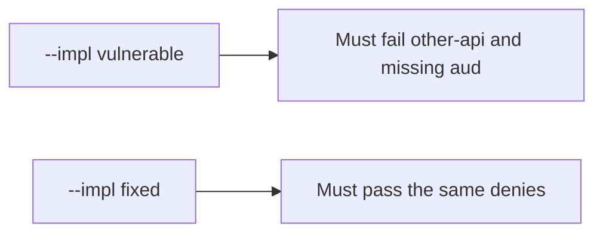

# 4.5-LO-05 — Evidence is wrong-aud false, then a passing pair

**Kind:** verification-lab
**Loop step:** 5 Verify
**Standards:** OWASP ASVS 5.0.0 (final) `v5.0.0-10.3.1`.

## An invariant that cannot fail a test is still a slogan

“OIDC is configured” is not evidence. The oracle is the local pair.

## Mental model: fail-on-vulnerable, pass-on-fixed



| Case | Must show |
|---|---|
| Negative / abuse | `aud=other-api` and missing `aud` are false |
| Normal | expected `aud` is true |
| Not claimed | PKCE; JWKS; DPoP; 1.2 on notes |

Lab tests in `labs/4.5/4.5-lab/tests/test_property.py`:

```
python3 -m pytest labs/4.5/4.5-lab/tests --impl vulnerable
python3 -m pytest labs/4.5/4.5-lab/tests --impl fixed
```

The honest expected-aud test may pass on both. That does not excuse the deny tests.

## What the tests do not prove

- PKCE / `state` / `nonce` (`v5.0.0-10.1.2`, `v5.0.0-10.2.1`)
- BFF token confinement (`v5.0.0-10.1.1`)
- Sender-constrained tokens (`v5.0.0-10.3.5` Level 3 advanced)
- Note authorization (4.4)

## Practice

Execute both implementations. Map each test to an LO-02 cell.

## Transfer

Clinic FHIR. A test that only asserts HTTP 200 is not audience evidence (see 9.3).
