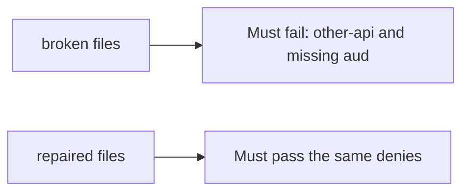

# A token for another API, or a missing audience, must fail

**Kind:** verification-lab
**Loop step:** 5 Verify

## Check it

An OpenID Connect checkbox does not bind audience. A verified JWT is a signature check. `accept_token({"sub": "alice", "aud": "other-api"}, "securecollab-api")` has to be false. Broken still accepts the other-api audience; repaired does not.

## Picture: other-api and missing aud must fail

Asserting a library called `verify` can still hide that a wrong-audience token still counts as a session.



| Mode | Must show for this topic |
|---|---|
| Normal | expected `aud` is true (may pass on both) |
| Wrong input / abuse | `aud=other-api` and missing `aud` are false; broken files must fail |
| Not claimed | PKCE; JWKS; DPoP; who-is-allowed on notes |

`labs/4.5/4.5-lab/tests/test_property.py` names `test_wrong_audience_is_rejected`. A wrong-audience token accepted as a session is the miss.

```text
python3 -m pytest labs/4.5/4.5-lab/tests --impl vulnerable
python3 -m pytest labs/4.5/4.5-lab/tests --impl fixed
```

A token whose `aud` is this API may stay allowed. Deny `other-api` and a missing audience. If the broken files do not fail other-api, the lab is miswired — fix the wiring, not the check. A setup error is not proof the rule holds.

## What the tests do not prove

- PKCE / `state` / `nonce`
- Backend-for-frontend token confinement
- Sender-constrained tokens (advanced)
- Note authorization (who-is-allowed)
- Native redirect safety (claimed HTTPS, not a custom scheme)

## Practice

Compare `aud`. A `verify` call in Authlib is the signature, not the audience.

## Use it somewhere new

HTTP 200 on a FHIR call is not audience evidence. Do not run a test that hits a live identity provider.

## What this page is not doing

Do not add a live token. Do not paste JWTs into tickets. Answer keys are not on this site.
