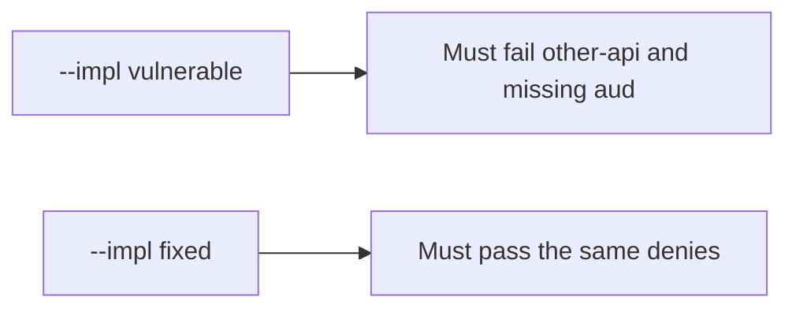

# 4.5-LO-05 — Evidence is wrong-aud false, then a passing pair

**Kind:** verification-lab
**Loop step:** 5 Verify
**Standards:** OWASP ASVS 5.0.0 (final) `v5.0.0-10.3.1`. OAuth 2.1 remains **draft**.

## An invariant that cannot fail a test is still a slogan

“OIDC is configured” is not evidence. “The JWT verifies” is a mechanism observation. The oracle is: `accept_token({"sub": "alice", "aud": "other-api"}, "securecollab-api")` is false. That observation must be **false** on `--impl vulnerable` (returns true) and **true** on `--impl fixed`.

## Mental model: vulnerable must fail: other-api and missing aud

The failing observation on `--impl vulnerable` is **other-api and missing aud**. A passing collection count is not this cell.



| Mode | Must show for this module |
|---|---|
| Normal | expected `aud` is true (may pass on both) |
| Negative / abuse | `aud=other-api` and missing `aud` are false; vulnerable must fail |
| Not claimed | PKCE; JWKS; DPoP; 1.2 on notes |

Lab tests in `labs/4.5/4.5-lab/tests/test_property.py`. `test_wrong_audience_is_rejected` is a **forbidden-outcome** test: a wrong-aud token accepted as a session is not allowed to count as a passing control.

```text
python3 -m pytest labs/4.5/4.5-lab/tests --impl vulnerable
python3 -m pytest labs/4.5/4.5-lab/tests --impl fixed
```

The honest expected-aud test may pass on both. That does not excuse the deny tests. If vulnerable does not fail other-api, the lab is miswired—fix the wiring, not the assertion.

## What the tests do not prove

- PKCE / `state` / `nonce` (`v5.0.0-10.1.2`, `v5.0.0-10.2.1`)
- BFF token confinement (`v5.0.0-10.1.1`)
- Sender-constrained tokens (`v5.0.0-10.3.5` Level 3 advanced)
- Note authorization (4.4)
- Native redirect safety (RFC 8252 / 8.3)

Record those as residuals or later modules, not as silent passes.

## Practice

Execute both implementations this session. Write the fail/pass pair next to the matrix row. Reject a “test” that only greps `verify` in an Authlib call without comparing `aud`.

## Transfer

Clinic FHIR. A test that only asserts HTTP 200 is not audience evidence (see 9.3). A test that hits a live IdP is out of scope.

## Non-goals

Do not add a live token. Do not paste JWTs into tickets. Keys stay out of this file.
