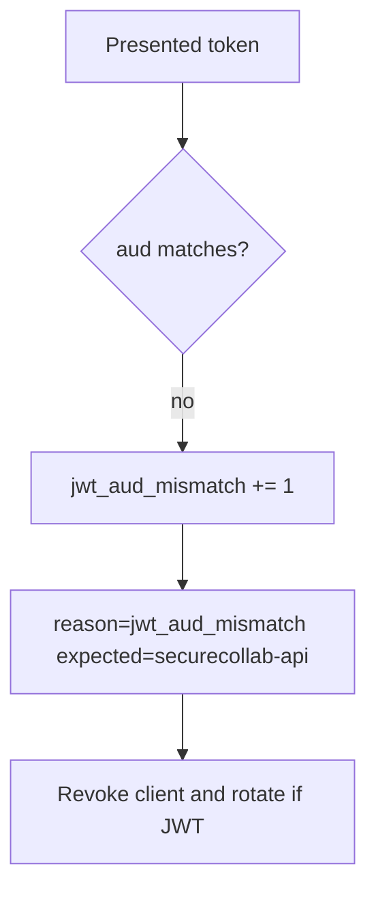

# Notice audience mismatch; revoke without logging tokens

**Kind:** operations-exercise
**Loop step:** 6 Operate

## Stopping it is not enough

A leaked token for this audience still spends until expiry or a sender-constraint. Pair notice and recover. Do not log raw tokens or note bodies. Do not paste a JWT into the ticket.

## Picture: audience mismatch is a signal



| Outcome | This topic |
|---|---|
| Notice | `jwt_aud_mismatch`; `client_revoked` |
| What the line holds | expected aud, token id or hash, client id; never the raw token |
| Recover | Revoke the client; rotate signing keys if tokens self-verify |
| Leftover | PKCE / nonce / DPoP not in this practice |

Industry lists talk about noticing, responding, and recovering. They do not prove the `aud` comparison. Naming a product is not the rule. Re-run `test_wrong_audience_is_rejected` after any verifier change; a green OpenID dashboard is not that check. Missing `aud` is the same what must not happen as `aud=other-api` — do not close one without retesting the other. A leaked token that already has the *correct* audience is leftover (revocation / sender-constraint), not a pass for this metric.

## What the framework does vs what you still have to check

An identity provider will page on failed logins and stay silent when this API accepts `aud=other-api`. Notice must observe the **resource-server comparison**, not the identity-provider tile. If the alert includes a raw JWT, you have opened a leak.

## Practice

Write one log line you would accept. Tie it to `labs/4.5/4.5-lab`.

```text
log_denied reason=jwt_aud_mismatch expected_aud=securecollab-api client_id=sc_web request_id=req_45oa
```

Reject any line that includes a raw JWT, a note body, or “OpenID Connect handled.”

## Use it somewhere new

A clinic example: notice FHIR tokens with the wrong hospital aud; do not paste the token into the ticket. Do not query a live FHIR server.

## What this page is not doing

Naming a product is not the rule. Live identity-provider audits are out of scope. This site does not mark you as finished.
