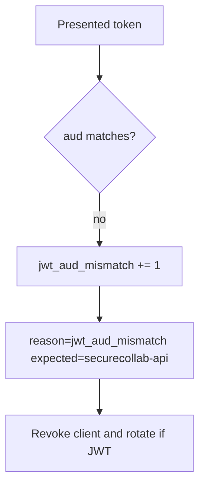

# Notice audience mismatch; revoke without logging tokens

**Kind:** operations-exercise
**Loop step:** 6 Operate

## Fixing it once is not enough

A leaked token for this audience still spends until expiry or a sender-constraint. Keep raw tokens, note bodies, and JWTs out of the ticket.

## Picture: audience mismatch is a signal



| Outcome | This topic |
|---|---|
| Notice | `jwt_aud_mismatch`; `client_revoked` |
| What the line holds | expected aud, token id or hash, client id; never the raw token |
| Recover | Revoke the client; rotate signing keys if tokens self-verify |
| Leftover | PKCE / nonce / DPoP not in this practice |

`aud=other-api` still has to fail `test_wrong_audience_is_rejected`. An OpenID tile does not compare `aud`. Missing `aud` is the same what must not happen as `aud=other-api` — do not close one without retesting the other. A leaked token that already has the *correct* audience is leftover (revocation / sender-constraint), not a pass for this metric.

## What the framework does vs what you still have to check

Failed-login paging does not catch this API accepting `aud=other-api`. Bind the **resource-server comparison**, not the identity-provider tile. Do not paste a raw JWT into the audience metric.

## Practice

```text
log_denied reason=jwt_aud_mismatch expected_aud=securecollab-api client_id=sc_web request_id=req_45oa
```

A raw JWT, a note body, or “OpenID Connect handled” has no business in the log.

## Use it somewhere new

Notice FHIR tokens with the wrong hospital aud; do not paste the token into the ticket. Do not query a live FHIR server.

## What this page is not doing

Do not use live identity-provider audits. This site does not mark you as finished.
