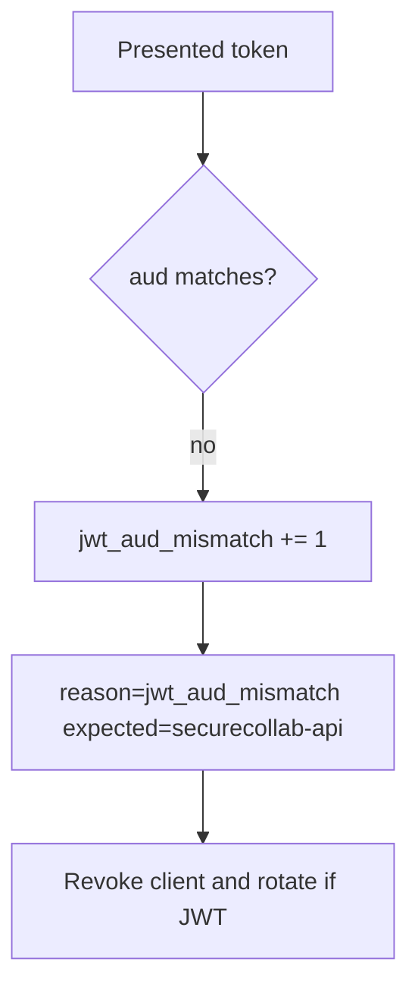

# 4.5-LO-06 — Detect jwt_aud_mismatch; revoke without logging tokens

**Kind:** operations-exercise
**Loop step:** 6 Operate
**Standards:** NIST CSF 2.0 (final) DE/RS/RC as outcome labels; OWASP ASVS 5.0.0 (final) `v5.0.0-10.3.1`.

## Prevention is not absolute

A leaked token for this audience still spends until expiry or sender-constraint. Pair detect and recover. Do not log raw tokens or note bodies (3.1, 4.3).

## Mental model: audience mismatch is a signal



| Outcome | This module |
|---|---|
| Detect | `jwt_aud_mismatch`; `client_revoked` |
| Signal | expected aud, token id or hash, client id; never the raw token |
| Recover | Revoke client; rotate signing keys if tokens self-verify |
| Residual | PKCE/nonce/DPoP not in this fixture |

## Practice

Write one log line you would accept. Tie it to `labs/4.5/4.5-lab`.

```
log_denied reason=jwt_aud_mismatch expected_aud=securecollab-api client_id=sc_web request_id=req_45oa
```

Reject any line that includes a raw JWT or a note body.

## Transfer

Clinic: detect FHIR tokens with the wrong hospital aud; do not paste the token into the ticket.

## Non-goals

SIEM product names are not the property.
