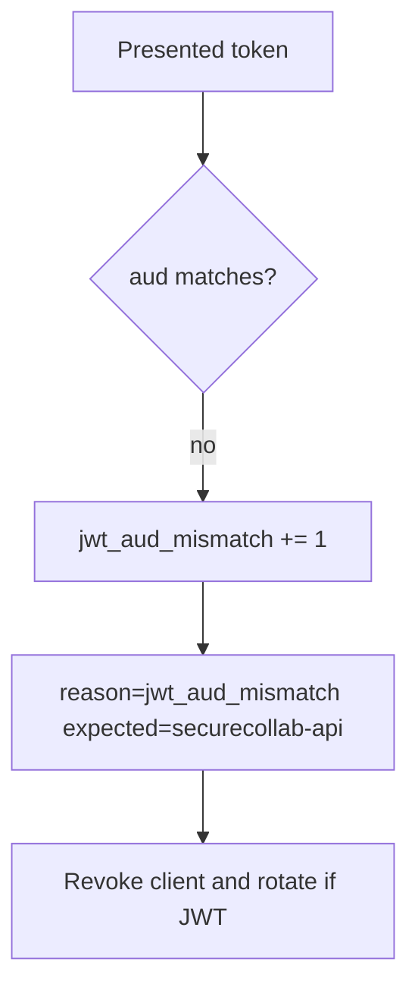

# 4.5-LO-06 — Detect jwt_aud_mismatch; revoke without logging tokens

**Kind:** operations-exercise
**Loop step:** 6 Operate
**Standards:** NIST CSF 2.0 (final) DE/RS/RC as outcome labels; OWASP ASVS 5.0.0 (final) `v5.0.0-10.3.1`. CSF names outcomes; it does not compare `aud`.

## Prevention is not absolute

A leaked token for this audience still spends until expiry or sender-constraint. Pair detect and recover. Do not log raw tokens or note bodies (3.1, 4.3). Do not paste a JWT into the ticket.

## Mental model: audience mismatch is a signal



| Outcome | This module |
|---|---|
| Detect | `jwt_aud_mismatch`; `client_revoked` |
| Signal | expected aud, token id or hash, client id; never the raw token |
| Recover | Revoke client; rotate signing keys if tokens self-verify |
| Residual | PKCE/nonce/DPoP not in this fixture |

CSF 2.0 Detect / Respond / Recover name outcomes. They do not prove `v5.0.0-10.3.1`. A SIEM product name is not the property. Re-run `test_wrong_audience_is_rejected` after any verifier change; a green OIDC dashboard is not that pytest. Missing `aud` is the same forbidden outcome as `aud=other-api` — do not close one without retesting the other. A leaked token that already has the *correct* audience is 4.1 / sender-constraint residual, not a pass for this metric.

## Framework defaults versus the operate guarantee

An IdP will page on failed logins and stay silent when this API accepts `aud=other-api`. Detection must observe the **resource-server comparison**, not the IdP tile. If the alert includes a raw JWT, you have opened a 4.3 / 3.1 cell.

## Practice

Write one log line you would accept. Tie it to `labs/4.5/4.5-lab`.

```text
log_denied reason=jwt_aud_mismatch expected_aud=securecollab-api client_id=sc_web request_id=req_45oa
```

Reject any line that includes a raw JWT, a note body, or “OIDC handled.”

## Transfer

Clinic: detect FHIR tokens with the wrong hospital aud; do not paste the token into the ticket. Do not query a live FHIR server.

## Non-goals

SIEM product names are not the property. Live IdP audits are out of scope. Gates 0–10 stay not-attempted.
