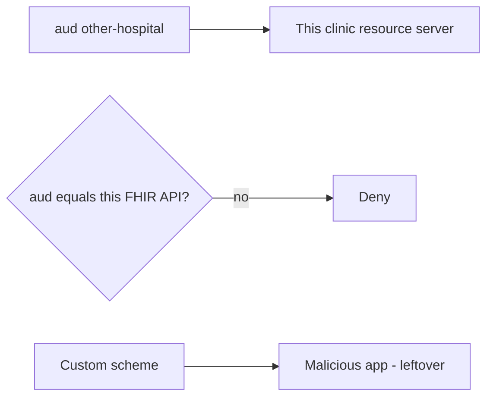

# Same idea on a wrong-audience FHIR token

**Kind:** transfer-challenge
**Loop step:** 7 Transfer

## Use it somewhere new

You get a **clinic FHIR resource server**. `accept_token` is false for `aud=other-api`. The same rule has to hold on a clinic FHIR resource server.

A FHIR token minted for another hospital is the same wrong audience. Also name native redirect (claimed HTTPS, not a custom scheme) vs browser vs backend-for-frontend storage.

EHR-lite that accepts SMART-on-FHIR-shaped access tokens.

1. who might try (token minted for another hospital API; stolen browser token; malicious phone app claiming a custom scheme — **not** a live clinic);
2. what you trust (which resource-server `aud` check is trusted; the vendor “OpenID dashboard” is not);
3. what must not happen (`accept_token` true for `other-hospital-fhir` — not a privacy-law name);
4. keep it on a **local** practice only (wrong aud and missing aud deny);
5. leftover (PKCE, mix-up, DPoP advanced, object grants, WebView);
6. whether a human consent screen must meet the web accessibility baseline (usable consent, not a mouse-only approve).

## Picture: hospital name in aud, not in the TLS certificate

TLS on the hop does not name the audience. Authlib signature-ok does not compare hospital ids. A custom URI scheme is leftover, not a silent pass. Browser-held access tokens are leftover (prefer a backend-for-frontend). OAuth 2.1 is still a draft — do not cite it as the rule.

## What is not good enough

| Reject | Why |
|---|---|
| “We use OAuth 2.1” as the rule | Draft, and not an aud check |
| Live clinic identity provider | Course rules |
| Signature-only verify | Skipped audience |
| HTTP 200 as audience evidence | Wrong observation |
| A privacy-law name as the check | Legal label |

## Practice

Reject a FHIR token minted for another hospital. Keep the answer keys closed. `labs/4.5/4.5-lab` is the only running system you may break. Do not replay a live FHIR token or register a malicious custom scheme against a real app.

## Can people still use it

If a human consent screen is in the claim, “approve” must be something keyboard and assistive tech can use, not only a mouse click. A usable consent screen is not the audience check.

## What this page is not doing

Do not try live-target token replay. Do not use real patient tokens. This page does not finish a check-in.
