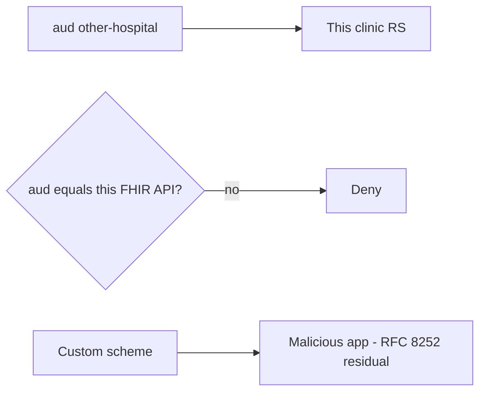

# 4.5-LO-07 — Transfer: wrong-aud FHIR token and native redirect

**Kind:** transfer-challenge
**Loop step:** 7 Transfer
**Standards:** RFC 8252 (final); RFC 10017 (final, August 2026); OWASP ASVS 5.0.0 (final) `v5.0.0-10.3.1` and `v5.0.0-10.1.1`. OAuth 2.1 remains **draft**.

## Change the workplace; keep audience-must-match

Do not answer with a Top 10 / CWE / scanner as the definition of security. The SecureCollab sentence was: `accept_token(..., "other-api")` is false. Rewrite it for a clinic FHIR RS without changing the fork.

**Prompt:** Clinic: wrong-aud FHIR token. Also name RFC 8252 native redirect vs SPA/BFF storage.

**Product sketch:** EHR-lite that accepts SMART-on-FHIR-shaped access tokens.

Rewrite the SecureCollab sentence. Include:

1. attacker capabilities (token minted for another hospital API; stolen SPA token; malicious native app claiming a custom scheme — **not** a live clinic);
2. trust assumptions (which RS `aud` check is TCB; the vendor “OIDC dashboard” is not);
3. forbidden outcome (`accept_token` true for `other-hospital-fhir`, not “HIPAA”);
4. a test idea on a **local** fixture only (wrong aud and missing aud deny);
5. residual (PKCE, mix-up, DPoP Level 3, 4.4 object grants, 8.3 WebView);
6. WCAG 2.2 if a human consent screen is in the claim (usable consent, not a mouse-only approve).

## Mental model: hospital name in aud, not in the TLS certificate

TLS on the hop does not name the audience. Authlib signature-ok does not compare hospital ids. A custom URI scheme is an RFC 8252 residual, not a silent pass. SPA-held access tokens are `v5.0.0-10.1.1` (prefer BFF). OAuth 2.1 is still draft — do not cite it as the property.

## What graders reject

| Reject | Why |
|---|---|
| “We use OAuth 2.1” as the property | Draft, and not an aud check |
| Live clinic IdP | Lab policy |
| Signature-only verify | Skipped audience |
| HTTP 200 as audience evidence | Wrong observation |
| HIPAA as the oracle | Legal label |

## Practice

One page. No keys. `labs/4.5/4.5-lab` is the only running system you may break. Do not replay a live FHIR token or register a malicious custom scheme against a real app.

## Non-goals

Live-target token replay. Real patient tokens. Claiming Gate 4 from this page.
