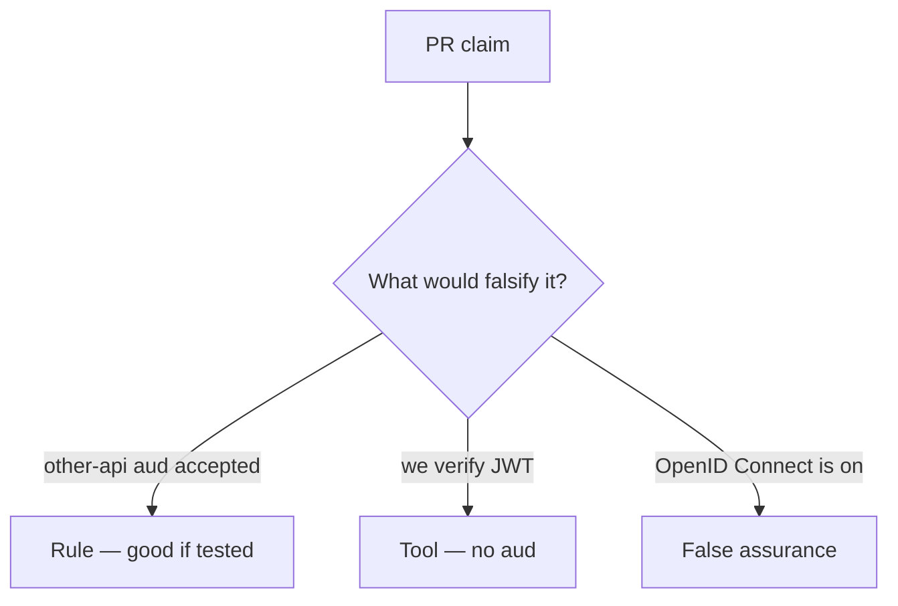

# Review of a skipped audience check

**Kind:** code-review
**Loop step:** Review

The answers are not on this page. Do not open the keys file until someone has looked at your review.

## What you are reviewing

Review `labs/4.5/4.5-lab/vulnerable/` as a change to notes-app token acceptance. Check whether `accept_token` still returns true for `aud=other-api`, compare that with the rule, and write changes a developer can verify.

The check you already ran (`test_wrong_audience_is_rejected`) is the rule test. A comment “will check aud later” is not.

## Picture: verify signature, skip aud

**verify signature, skip aud**. Label it rule, tool, or false assurance before you accept the change.

A wrong `aud` still has to be denied. If the change never compares `aud`, that leftover path is still open.

## Problems to find (name them yourself)

- verify signature, skip aud
- ID token used as API access token
- Implicit flow in SPA README
- No test other-api aud

Also reject: treating the client as what you trust; closing findings without re-running `test_wrong_audience_is_rejected`; keys in learner notes; real tokens in practice files; OAuth 2.1 presented as final.

## Common mix-ups

- OpenID Connect login replaces your matrix
- JWT means OAuth is done
- A phone-app custom scheme is a safe redirect
- Authlib defaults check `aud`
- TLS names the audience

## Practice

Write three review notes a maintainer could act on. Each note: what you saw, rule or false assurance, suggested structural change, leftover you will **not** delete. Tie at least one to `test_wrong_audience_is_rejected`. Do not open the keys file.

## Use it somewhere new

Clinic change that “enables SMART” without an `aud` test is an incomplete review. Name the independent falsehood that would still keep `other-api` from spending this resource server.

## What this page is not doing

Do not merge by adding a comment “will check aud later.” That comment is leftover risk without an owner. Do not replay a live token to prove the finding.
