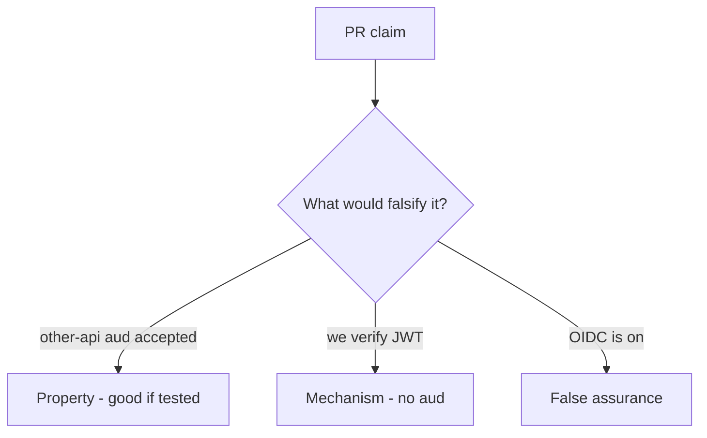

# 4.5-LO-08 — Review skipped audience as a PR, not an OIDC ticket

**Kind:** code-review
**Loop step:** Review
**Standards:** OWASP ASVS 5.0.0 (final) `v5.0.0-10.3.1`; RFC 9700 (final). OAuth 2.1 remains **draft**.

## Review the fixture as if it were SecureCollab token acceptance

Review `labs/4.5/4.5-lab/vulnerable/` as a SecureCollab PR. Your job is not to count suspicious lines. Reconstruct whether `accept_token` still returns true for `aud=other-api`, compare that with the module invariant, and write changes a developer can verify.

Intended findings live only in `content/assessment/keys/4.5.md` — not here. Do not open the keys file until your review has been evaluated.

## Mental model: verify signature, skip aud

Start with this seeded smell: **verify signature, skip aud**. Label it property, mechanism, or false assurance before you accept the PR.

Classification starts at the protected effect (wrong aud denied). Everything that is not an `aud` comparison at that call is a candidate ambient path.

## Seeded smells (label them yourself)

- verify signature, skip aud
- ID token used as API access token
- Implicit flow in SPA README
- No test other-api aud

Also reject: client trust; closing findings without re-running `test_wrong_audience_is_rejected`; keys in lessons; real tokens in fixtures; OAuth 2.1 presented as final.

## Misconceptions this module refuses

- OIDC login replaces your matrix
- JWT means OAuth is done
- Mobile custom scheme is a safe redirect
- Authlib defaults check `aud`
- TLS names the audience

## Practice

Write three review notes a maintainer could act on. Each note: observation, property or false assurance, suggested structural change, residual you will **not** delete. Tie at least one to `test_wrong_audience_is_rejected`.

## Transfer

Clinic PR that “enables SMART” without an `aud` test is an incomplete mediation review. Name the independent falsehood that would still keep `other-api` from spending this RS.

## Non-goals

Do not merge by adding a comment “will check aud later.” That comment is a residual without an owner. Do not replay a live token to prove the finding.
