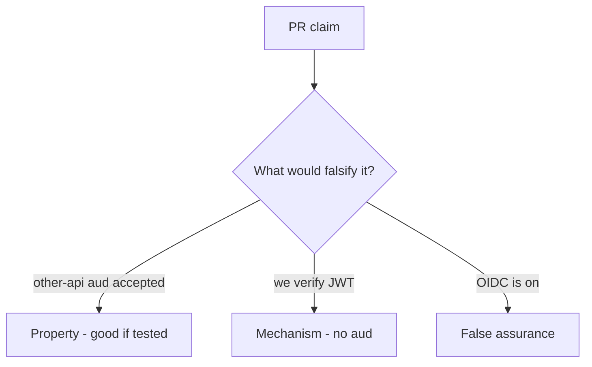

# 4.5-LO-08 — Review skipped audience as a PR, not an OIDC ticket

**Kind:** code-review
**Loop step:** Review
**Standards:** OWASP ASVS 5.0.0 (final) `v5.0.0-10.3.1`; RFC 9700 (final).

## Review the fixture as if it were SecureCollab token acceptance

Review `labs/4.5/4.5-lab/vulnerable/` as a SecureCollab PR. Intended findings live only in `content/assessment/keys/4.5.md` — not here.

## Mental model: property, mechanism, or false assurance

Seeded smells (label them yourself; do not open the keys file):

- verify signature, skip aud
- ID token used as API access token
- Implicit flow in SPA README
- No test other-api aud

Also reject: client trust, closing findings without retest, keys in lessons, real tokens in fixtures, OAuth 2.1 presented as final.

## Misconceptions

- OIDC login replaces your matrix
- JWT means OAuth is done
- Mobile custom scheme is a safe redirect

## Practice

Write three review notes. Tie at least one to `test_wrong_audience_is_rejected`.

## Transfer

Clinic PR that “enables SMART” without an `aud` test is incomplete.
