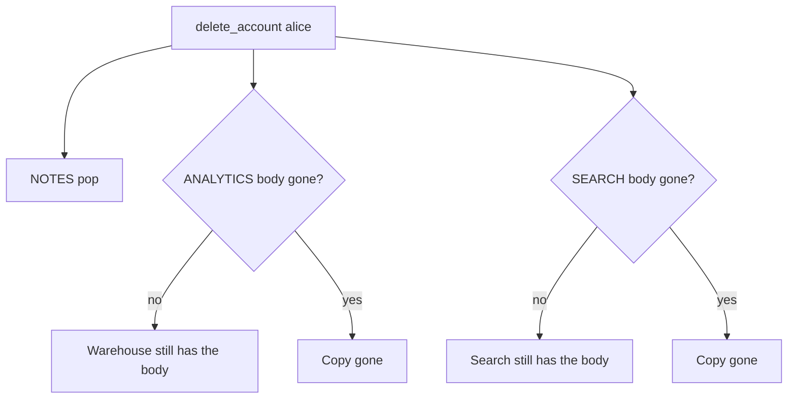
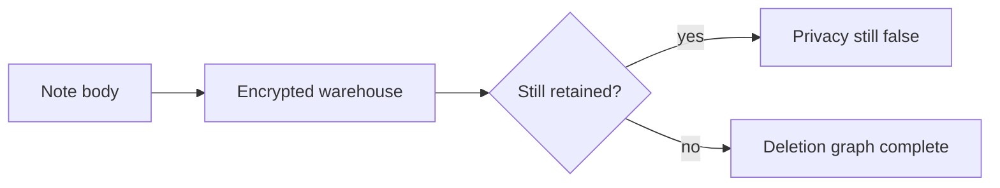

# Delete must walk every copy, not only the notes table

**Kind:** concept-model
**Loop step:** 1 Property

## The rule

The notes app stores note bodies in more than one place: the notes table, an analytics copy, a search index. Deleting `alice` is a change over **time**. After that, those bodies must not still be sitting around.

Encrypting a warehouse you still keep is not deletion. A privacy-policy PDF is not the list of copies.

> After `delete_account("alice")`, `body_retained("alice")` must be None and `search_retained("alice")` must be None. Deletion is every copy of the body, not a notes-table DELETE. Clearing the notes row, and “we anonymized the user id,” do not by themselves remove the body.

So what must not happen: **analytics (or search) still holds the note body after account deletion**. The body was already confidential. After the person leaves, keeping the field is leftover privacy too. Encryption without erasure still retains.

You need to name sensitive data, write down how long you keep it, not hand the body to a second party you do not control, and actually carry those rules out. A scheduled warehouse job that maybe runs later is advanced work, not this week's check. A published privacy framework names identify, govern, control, and communicate. A newer draft of that framework is still a draft. A threat-method name does not walk the copies. The local maps do. Phone privacy profiles come later. A country privacy-law name is awareness, not this check. A database DELETE is not this sentence.

## Picture: the deletion graph



The person who can still read it is an insider with warehouse SELECT, or a buyer of a “de-identified” export that still contains bodies. Trusting “analytics is anonymized” without checking the body field is not what you trust.

**The tool (not the rule):** a database DELETE, an object-store lifecycle rule, or a contract checkbox.

## Picture: privacy is not secrecy



Secrecy can hold while privacy fails. The body was already classified confidential. This week's question is whether that field still exists after delete.

## Why it happens, what it costs, how you stop it, how you notice, how you recover

Someone deleted the notes row and left the other copies. That is the cause. The person who later SELECTs the warehouse is a **result**, not the cause.

| Slice | For this rule |
|---|---|
| Why it happens | A second copy was not in the deletion graph |
| What has to be true first | `delete_account` pops NOTES only |
| Trigger | Analytics or search read after they leave |
| What it costs | Privacy plus leftover confidential bodies after the relationship ends |
| How you stop it | Inventory the copies; delete or unlink the body in each |
| How you notice | `deleted_user_body_hits` (ids only, no bodies) |
| How you recover | Purge partitions; a named legal-hold exception with an owner |

## What the framework does vs what you still have to check

A database DELETE is not warehouse DELETE. The web app does not erase object-store analytics. The app's promise: after `delete_account("alice")`, `body_retained("alice")` is None and `search_retained("alice")` is None. The local check is `labs/5.1/5.1-lab`. Fake data only. No live warehouse.

## What the tool cannot do

- Anonymize ids but keep bodies — still a body left behind.
- Backups (named later; restore is a later topic); a phone's offline cache (later); support tickets with paste.
- Legal-hold copies — a named exception with an owner, not a silent keep.

## Practice

Draw collection → use → share → retain → delete for the body. Then run:

```text
python3 -m pytest labs/5.1/5.1-lab/tests --impl vulnerable
python3 -m pytest labs/5.1/5.1-lab/tests --impl fixed
```

Tie the failures to `body_retained` / `search_retained`, not to a privacy-law name.

## Use it somewhere new

A clinic example: an appointment card that still stores notes after the patient record is deleted.

## Can people still use it

The delete-account journey must be completable with a keyboard and a clear status. If people cannot reach delete, the copies stay. Do not encode “deleted” as color only.

## What this page is not doing

Do not use live warehouses, real people's data, weaponized dumps. Answer keys are not on this site.
