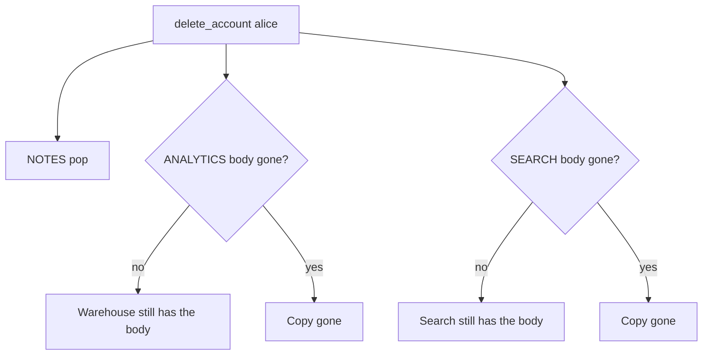

# 5.1-LO-01 — Delete must walk every copy, not only the notes table

**Kind:** concept-model
**Loop step:** 1 Property
**Standards:** NIST Privacy Framework 1.0 (final); NIST Privacy Framework 1.1 IPD remains **draft**; OWASP ASVS 5.0.0 (final) `v5.0.0-14.1.1`, `v5.0.0-14.1.2`, `v5.0.0-14.2.3`, `v5.0.0-14.2.4`; `v5.0.0-14.2.7` is **Level 3, advanced**. MASVS-PRIVACY is a later mobile profile, not this lab. India DPDP Act/Rules are **awareness**. Postgres DELETE is not this sentence.

## The claim this module owns

SecureCollab Phase 1 stores note bodies in more than one place: the notes table, an analytics copy, a search index. Deleting `alice` is a 1.1 privacy and confidentiality change over **time**: those bodies must not remain after the product relationship ends. Encryption of a warehouse you still keep is not deletion. A privacy-policy PDF is not the deletion graph.

> After `delete_account("alice")`, `body_retained("alice")` must be None and `search_retained("alice")` must be None. Inventory is complete mediation across copies. `DELETE FROM notes` and “we anonymized the user id” do not by themselves remove the body.

The forbidden outcome is **analytics (or search) still holds the note body after account deletion**. That is leftover Confidential data (3.1) after the subject left (4.1). Privacy is not the same cell as confidentiality: encryption without erasure still retains.

ASVS `v5.0.0-14.1.1` wants sensitive data identified and classified. `v5.0.0-14.1.2` wants documented retention and privacy requirements per level. `v5.0.0-14.2.3` wants sensitive data not sent to untrusted parties (analytics as a second controller). `v5.0.0-14.2.4` wants those requirements implemented. `v5.0.0-14.2.7` (automatic deletion on a schedule) is **Level 3 (advanced)**. Privacy Framework 1.0 names Identify/Govern/Control/Communicate outcomes; 1.1 IPD is **draft**. LINDDUN waits as a method name; the oracle is the local maps.

## Mental model: the deletion graph



The attacker is an insider with warehouse SELECT, or a buyer of a “de-identified” export that still contains bodies. Trusting “analytics is anonymized” without checking the body field is not a TCB.

**Mechanism (not the property):** Postgres DELETE, S3 lifecycle, or a DPA checkbox.

## Mental model: privacy is not confidentiality


Confidentiality can hold while privacy fails. 3.1 classified the body as Confidential; this module asks whether that field still exists after delete.

## Root cause vs impact vs prevention vs detection vs recovery

| Slice | For this property |
|---|---|
| Root cause | Secondary copy not in the deletion graph |
| Preconditions | `delete_account` pops NOTES only |
| Trigger | Analytics or search read after offboard |
| Impact | Privacy + confidentiality of bodies after the relationship ends |
| Prevention | Inventory copies; delete or unlink bodies in each |
| Detection | `deleted_user_body_hits` (ids only, no bodies) |
| Recovery | Purge partitions; named legal-hold exception (E6) |

## Framework defaults versus the deletion guarantee

Postgres DELETE is not warehouse DELETE. Next.js does not erase S3 analytics. Oracle: `labs/5.1/5.1-lab`. No live warehouse.

## Mechanism limits

- Anonymize ids but keep bodies — still a body-retention fail.
- Backups (this module names them; restore is 5.5); mobile cache (8.2); support tickets with paste.
- Legal hold copies — named exception with owner (E6).

## Practice

Draw collection → use → share → retain → delete for the body. Then run:

```
python3 -m pytest labs/5.1/5.1-lab/tests --impl vulnerable
python3 -m pytest labs/5.1/5.1-lab/tests --impl fixed
```

The first command must fail. The second must pass. Map failures to `body_retained` / `search_retained`, not to “GDPR.”

## Transfer

Clinic appointment card that still stores notes after the patient record is deleted.

## Non-goals

Live warehouses, real PII, weaponized dumps. Gates 0–10 and milestones M0–M5 stay **not-attempted** without learner or product evidence. Answer keys are not in this file.

## Usability and accessibility

The delete-account journey must be completable with keyboard and a clear status (WCAG 2.2). An unreachable delete is a privacy incident (1.4).
