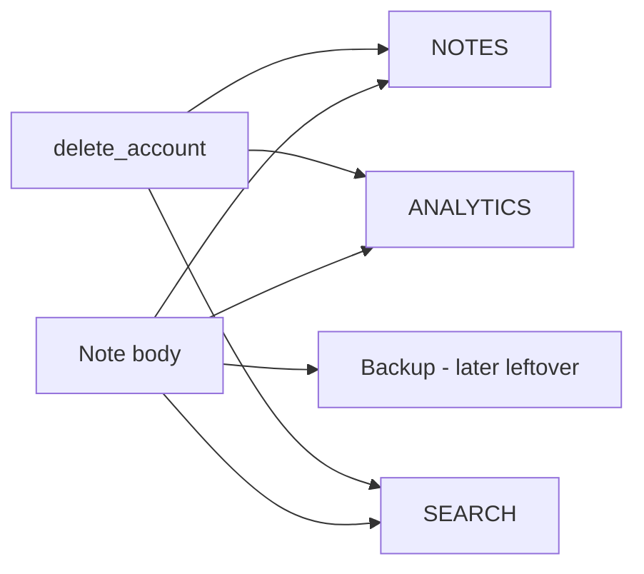
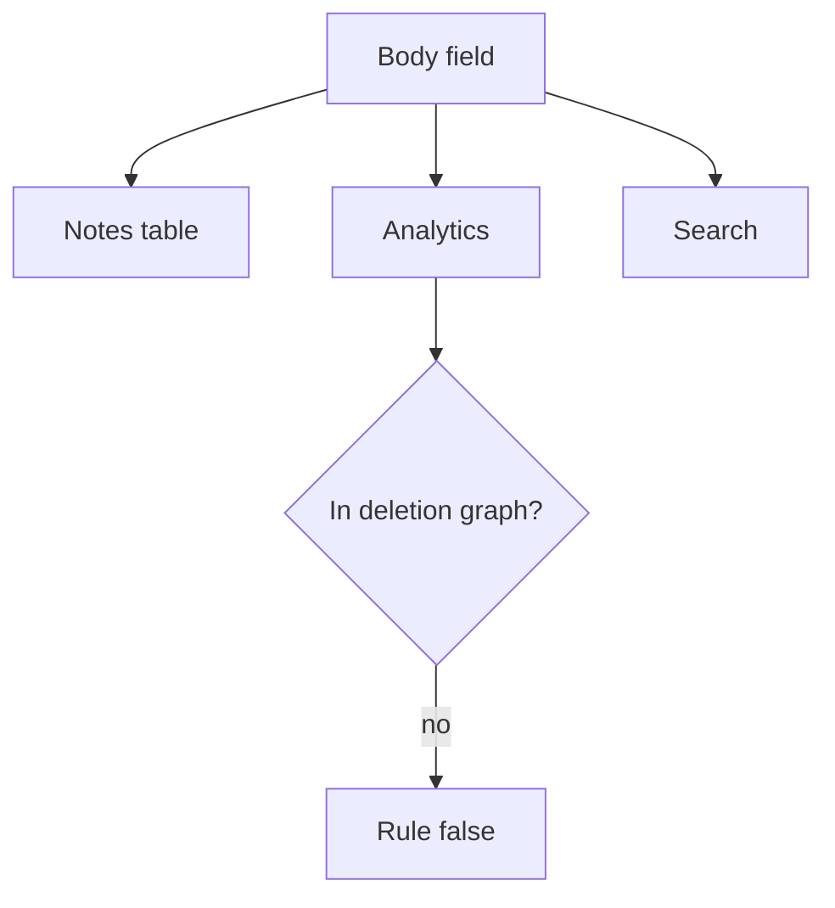

# A deletion graph someone else can test

**Kind:** design-exercise
**Loop step:** 2 Model

## Could someone else name the checks?

“We delete the user” is not this lesson. A map someone else can test names **every copy of the body** and **who may keep an exception**.

`NOTES` / `ANALYTICS` / `SEARCH` is local. User `alice`. No live warehouse.

> After `delete_account("alice")`, `body_retained("alice")` must be None and `search_retained("alice")` must be None. If a copy is missing from the map, leftover retention appears.

## Picture: every copy is a row

If an arrow is missing, leftover retention appears. This week's check runs notes, analytics, and search.

## Picture: name the copies before you redact

You already classified the body as confidential, per place. This week adds *time after delete*.

## Step 1: name the pieces

| Piece | This system |
|---|---|
| Who | alice; analytics insider; export buyer |
| What | note body in NOTES, ANALYTICS, SEARCH |
| Actions | `delete_account`; `body_retained`; `search_retained` |
| Paths | App database; warehouse; search index |
| What you trust | The delete path that walks the inventory |
| What you do not trust | “Anonymized”; a privacy-policy PDF |
| Time | Read after delete |
| The rule | Privacy plus secrecy of the body over time |

## Step 2: write allow and deny

| Who | What | Action | Decision |
|---|---|---|---|
| alice (active) | analytics body | retain | allow (product) |
| alice (deleted) | analytics body | retain | deny |
| alice (deleted) | search body | retain | deny |
| legal-hold owner | named copy | retain | exception (documented, with an owner) |

A missing “deleted alice × analytics body × deny” row is how the warehouse still holds the note. Write the hole.

## Practice

Label `lifecycle.py` in `labs/5.1/5.1-lab`. Your artifact is a versioned list (even a table in your notes) with copy, allow or deny, and what would show the deny is false. Fake data only.

## Use it somewhere new

A clinic example: appointment card plus notes. Partner CSV export.

## What can still go wrong

Backups still contain the row (later). A phone's offline cache (later). Tickets with paste.

## What this page is not doing

Do not run this map against a public clinic or a live warehouse. Answer keys are not on this site.
