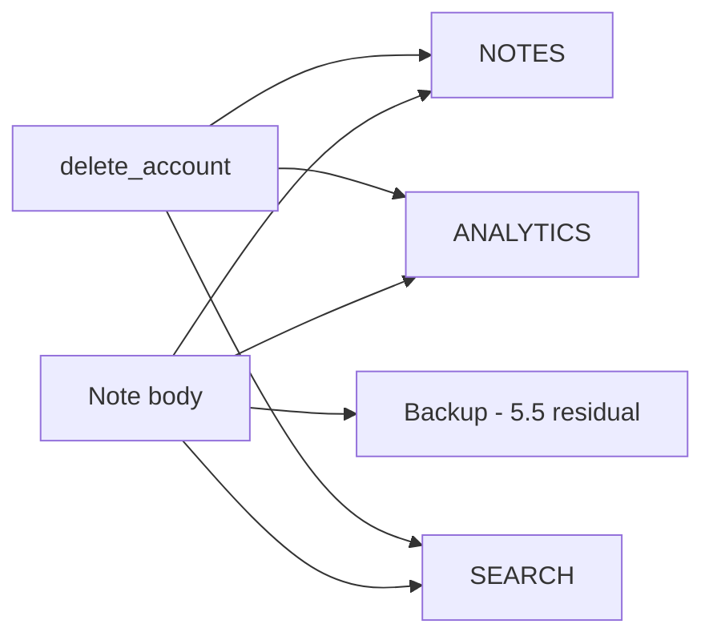
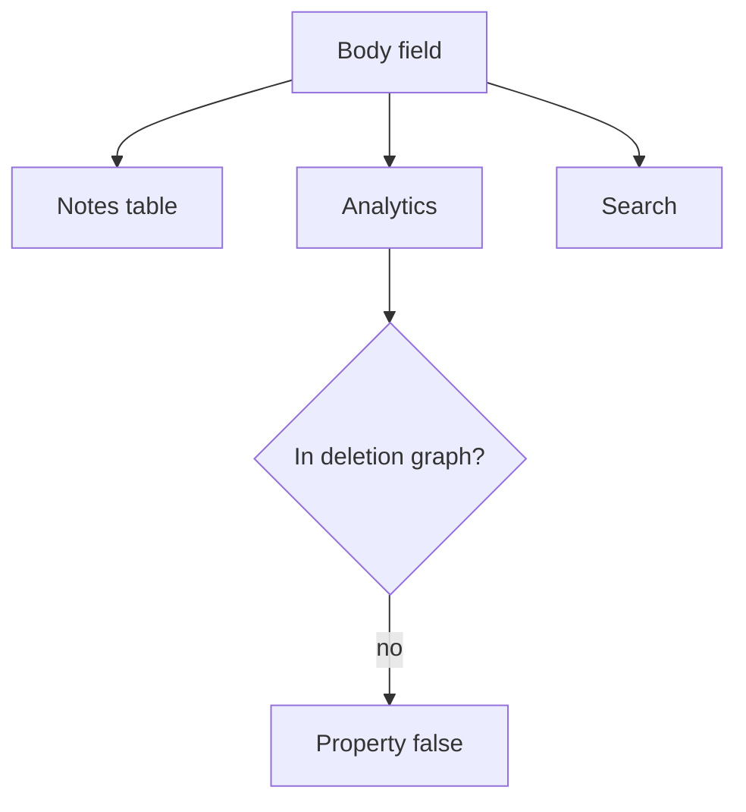

# 5.1-LO-02 — A deletion graph a second engineer can test

**Kind:** design-exercise
**Loop step:** 2 Model
**Standards:** NIST Privacy Framework 1.0 (final); OWASP ASVS 5.0.0 (final) `v5.0.0-14.1.1` and `v5.0.0-14.2.4`.

## Can a second engineer name pytest cases from your inventory?

“We delete the user” is not this lesson. A reviewable model names **every copy of the body** and **who may retain an exception**.

SecureCollab Phase 1 freeze: local `NOTES` / `ANALYTICS` / `SEARCH`. User `alice`. No live warehouse.

## Mental model: every copy is a row

If an arrow is missing, leftover retention appears. This lab executes notes, analytics, and search.

## Mental model: inventory before redaction

Module 3.1 classified Confidential × sink. This module adds *time after delete*.

## Step 1: freeze pieces

| Piece | This system |
|---|---|
| Subjects | alice; analytics insider; export buyer |
| Objects | note body in NOTES, ANALYTICS, SEARCH |
| Actions | `delete_account`; `body_retained`; `search_retained` |
| Channels | App DB; warehouse; search index |
| TCB | Delete use-case that walks the inventory |
| Untrusted | “Anonymized”; privacy-policy PDF |
| State / time | Read after delete |
| 1.1 cell | Privacy + confidentiality over time |

## Step 2: write cells

| Subject | Object | Action | Decision |
|---|---|---|---|
| alice (active) | analytics body | retain | allow (product) |
| alice (deleted) | analytics body | retain | deny |
| alice (deleted) | search body | retain | deny |
| legal-hold owner | named copy | retain | exception (E6, documented) |

## Practice

Draw this map so a second engineer could name pytest cases. Point at `labs/5.1/5.1-lab` file `lifecycle.py`.

## Transfer

Clinic appointment card + notes. Partner CSV export.

## Residual risk

Backups (5.5); mobile cache (8.2); tickets with paste.

## Non-goals

Top 10 as the definition of security. Keys stay out of lessons.
