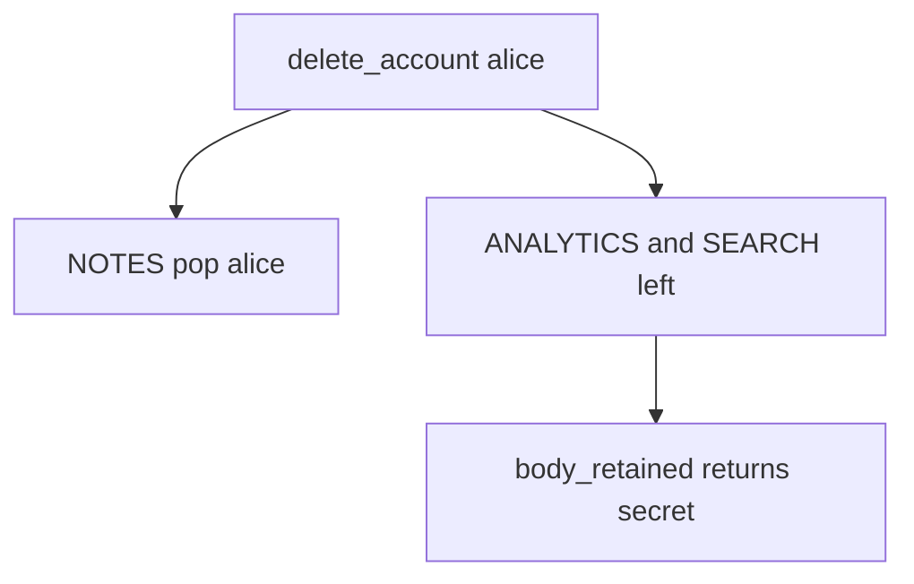

# 5.1-LO-03 — Observe the leftover analytics body, do not trophy a warehouse dump

**Kind:** mechanism-lab
**Loop step:** 3 Break
**Standards:** OWASP ASVS 5.0.0 (final) `v5.0.0-14.2.3` and `v5.0.0-14.2.4`. NIST Privacy Framework 1.0 (final) names Control outcomes; Privacy Framework 1.1 remains **draft**.

## Authorized scope

`labs/5.1/5.1-lab` only. The fixture is an in-process `delete_account` plus `body_retained` / `search_retained`. Synthetic user `alice` and body `secret`. It does not open PostgreSQL, S3, or a warehouse. Do not dump a live analytics store, an employer warehouse, or a classmate preview as this exercise.

**Forbidden outcome:** analytics (or search) still holds the note body after account deletion. After `delete_account("alice")`, `body_retained("alice")` returns `"secret"`.

Attacker capability in this lab: an insider with SELECT on `ANALYTICS`, or a buyer of a “de-identified” export that still contains bodies. That stands in for a partner CSV, a search-index replica, or an appointment-card note that outlived the patient row. Trust assumption: `delete_account` is supposed to walk every listed copy. A DPA PDF, “we anonymized the user id,” and Postgres `DELETE FROM notes` are not in the TCB for this cell.

## Mental model: notes gone, copies live



The vulnerable tree demonstrates **cause** (copy missing from the graph), not a trophy dump of a production warehouse. Preconditions: `delete_account` only pops `NOTES`; `body_retained` still returns `ANALYTICS.get(user)`. You do not need a live warehouse query. You must not run one.

ASVS `v5.0.0-14.2.4` wants documented retention implemented. Encryption of a warehouse you still keep is confidentiality theater, not this privacy cell.

## What to read in the fixture

`vulnerable/lifecycle.py` `delete_account` only pops `NOTES`. Tests:

- `test_deleted_account_leaves_no_analytics_body`
- `test_deleted_account_leaves_no_search_copy`
- `test_active_account_analytics_present` — honest product path; analytics exists *before* delete

You do not need a new store name. The failure of `test_deleted_account_leaves_no_analytics_body` *is* the evidence.

Do not open the fixed tree yet. Diagnose the cause first.

## Root cause vs impact vs prevention vs detection vs recovery

| Slice | This lab |
|---|---|
| Required property | After delete, analytics and search bodies are None |
| Root cause | Secondary copy not in the deletion graph |
| Preconditions | `delete_account` pops NOTES only |
| Trigger | `delete_account("alice")` then `body_retained("alice")` |
| Impact | Privacy + leftover Confidential data (3.1) after the subject left (4.1) |
| Prevention | Inventory copies; pop or unlink bodies in the same use-case |
| Detection | `deleted_user_body_hits` by user id and store name; never the body |
| Recovery | Purge partitions; named legal-hold owner (E6) |
| Not the lesson | A privacy-law name, a DPA checkbox, or a live warehouse dump |

## Framework defaults versus the deletion guarantee

Postgres `DELETE FROM notes` is not warehouse DELETE. Next.js does not erase S3 analytics. FastAPI returning 200 on `/account` is not `body_retained is None`. The application guarantee is: **this** fixture, after delete, both copies are None.

## Practice

```text
python3 -m pytest labs/5.1/5.1-lab/tests --impl vulnerable
```

Record `test_deleted_account_leaves_no_analytics_body`. Do not weaken it to “the notes row is gone.” An environment error is not security evidence.

## Transfer

Clinic: patient deleted; appointment-card notes remain. Predict without leaving this directory. Do not query a live warehouse.

## Usability

An unreachable delete-account journey is a privacy incident (1.4, WCAG 2.2). A mouse-only “delete” that people cannot complete leaves the copies in place.

## Non-goals

No live warehouse dumps. Synthetic bodies only.
