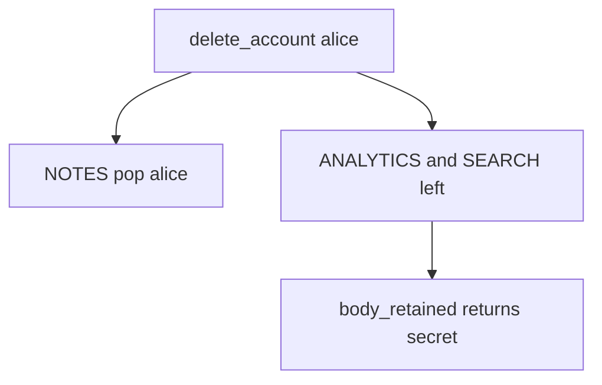

# 5.1-LO-03 — Observe the leftover analytics body, do not trophy a warehouse dump

**Kind:** mechanism-lab
**Loop step:** 3 Break
**Standards:** OWASP ASVS 5.0.0 (final) `v5.0.0-14.2.3` and `v5.0.0-14.2.4`.

## Authorized scope

`labs/5.1/5.1-lab` only. Synthetic user `alice` and body `secret`. No live warehouses.

**Forbidden outcome:** Analytics copy still holds note body after account deletion.

## Mental model: notes gone, copies live



The vulnerable tree demonstrates **cause** (copy missing from the graph), not a trophy dump of a production warehouse.

## What to read in the fixture

`vulnerable/lifecycle.py` `delete_account` only pops `NOTES`. `body_retained` and `search_retained` still return the body. Tests require both None after delete, and analytics present before delete.

## Root cause vs impact

| Slice | Lab |
|---|---|
| Root cause | Secondary copy not in the deletion graph |
| Impact | Body persists after the person left |
| Not the lesson | A privacy-law name as the definition |

## Practice

```
python3 -m pytest labs/5.1/5.1-lab/tests --impl vulnerable
```

Record `test_deleted_account_leaves_no_analytics_body`. Do not weaken it to “the notes row is gone.”

## Transfer

Clinic: patient deleted; appointment-card notes remain. Predict without leaving this directory.

## Non-goals

No live-target instructions. Synthetic data only.
