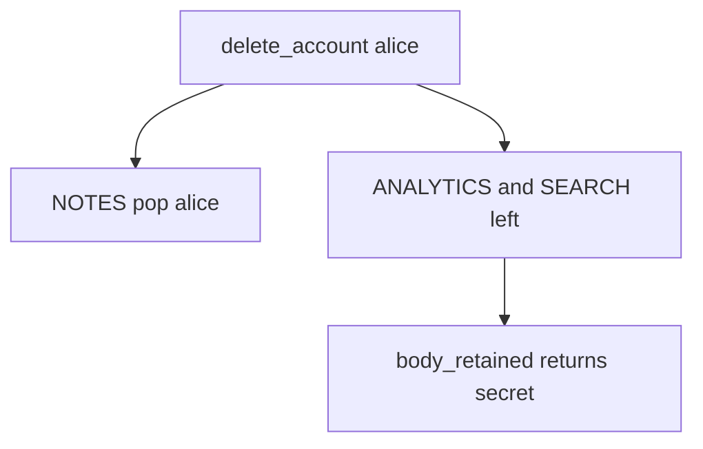

# Practice: analytics still holds the note after delete

**Kind:** mechanism-lab
**Loop step:** 3 Break

## Try it

The practice is not a warehouse you attack. `delete_account` plus `body_retained` / `search_retained`: delete pops the notes map and leaves analytics, so the leftover body still searches.

> After `delete_account("alice")`, `body_retained("alice")` must be None. If it still returns `"secret"`, analytics still holds the note.

## Where you may practice

Stay inside `labs/5.1/5.1-lab`. `delete_account` plus `body_retained` / `search_retained` use the synthetic name `alice` and the body `secret`. It does not open a database, object storage, or a warehouse.

Do not dump a live analytics store. Do not dump an employer warehouse. Do not dump a classmate preview. Do not query a warehouse “to see what happens.”

What is supposed to stop this: `delete_account` is supposed to walk every listed copy. A contract PDF, “we anonymized the user id,” and a database `DELETE FROM notes` are not enough.

Who can still read it, in this story: an insider with SELECT on `ANALYTICS`, or a buyer of a “de-identified” export that still contains bodies. That stands in for a partner CSV, a search-index replica, or an appointment-card note that outlived the patient row.

## Picture: notes gone, copies live



You do not need a live warehouse query. You must not run one. The leftover still returning `"secret"` *is* the leak.

Documented retention has to be actually carried out. Encrypting a warehouse you still keep is secrecy theater, not this privacy check.

## What to look at: the cause, not a hunt

In `vulnerable/lifecycle.py`, `delete_account` only pops `NOTES`. Tests:

- `test_deleted_account_leaves_no_analytics_body`
- `test_deleted_account_leaves_no_search_copy`
- `test_active_account_analytics_present` — honest product path; analytics exists *before* delete

You do not need a new store name.

| What you see | What kind of failure | Not the lesson |
|---|---|---|
| Notes gone, analytics still has `secret` | Copy missing from the graph | “The notes row is gone” |
| `body_retained` returns `ANALYTICS.get(user)` | Warehouse still holds the body | A privacy-law name |
| Search left in place | Same leftover, other copy | A contract checkbox |

## Why it happens vs what it costs

| Slice | Practice |
|---|---|
| Why it happens | A second copy was not in the deletion graph |
| What has to be true first | `delete_account` pops NOTES only |
| Trigger | `delete_account("alice")` then `body_retained("alice")` |
| What it costs | Privacy plus leftover confidential data after the person left |
| How you stop it later | Inventory the copies; pop or unlink bodies in the same delete |
| How you notice later | `deleted_user_body_hits` by user id and store name; never the body |
| How you recover later | Purge partitions; a named legal-hold owner |
| Out of scope | A privacy-law name, a contract checkbox, or a live warehouse dump |

A database `DELETE FROM notes` is not warehouse DELETE. The web app does not erase object-store analytics. An HTTP 200 on `/account` is not `body_retained is None`. After delete, both copies are None.

## Practice

```text
python3 -m pytest labs/5.1/5.1-lab/tests --impl vulnerable
```

Record the failing test `test_deleted_account_leaves_no_analytics_body`. Do not weaken it to “the notes row is gone.” A setup error is not proof the rule holds.

## Use it somewhere new

A clinic example: patient deleted; appointment-card notes remain. Predict, without leaving this directory, whether deleting the patient row clears the card. Do not query a live warehouse.

## Can people still use it

If people cannot reach delete-account with a keyboard, the copies stay. A mouse-only “delete” that people cannot complete is leftover retention, not a polish item.

## What this page is not doing

No live warehouse dumps. Synthetic bodies only. Do not “fix” the practice by deleting the test.
