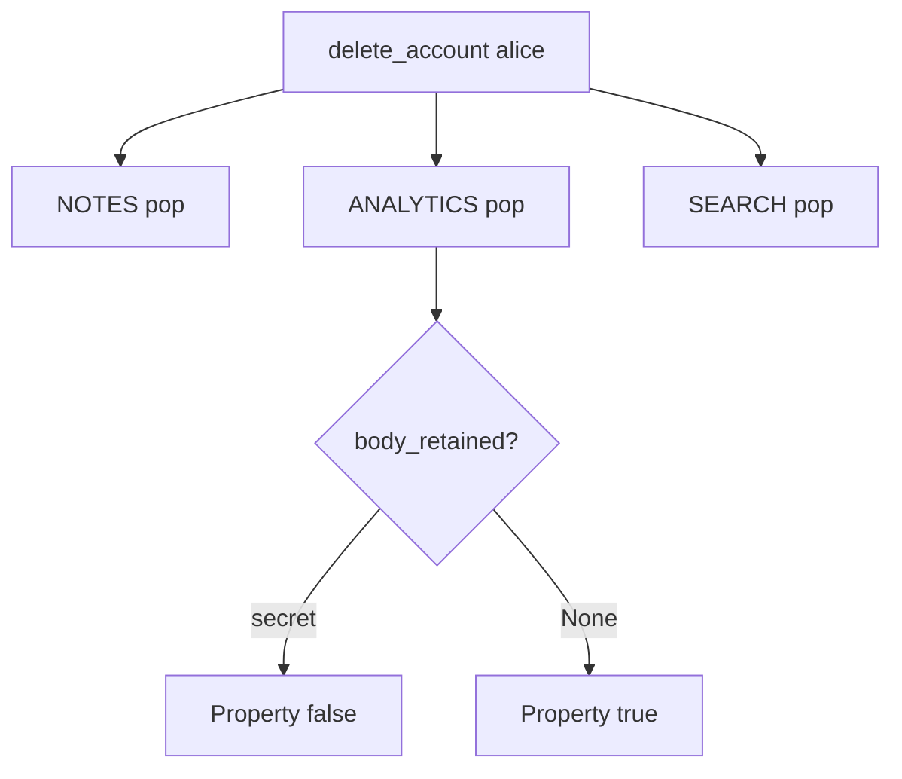

# 5.1-LO-04 — Walk the inventory in the same delete use-case

**Kind:** design-exercise
**Loop step:** 4 Build
**Standards:** OWASP ASVS 5.0.0 (final) `v5.0.0-14.2.4`. `v5.0.0-14.2.7` (scheduled automatic deletion) is **Level 3, advanced**, not this pytest.

## Structural means every listed copy is gone

`delete_account` must pop `NOTES`, `ANALYTICS`, and `SEARCH`. Structural means the use-case owns the graph — not a privacy PDF, not “anonymize the user id,” not encryption of a kept row, not a later warehouse job you hope runs.

The smallest restore for SecureCollab Phase 1 note bodies is: one call walks every listed copy. Fail-safe: if a listed copy cannot be reached, **do not claim delete complete** (refuse the use-case or alert). Do not fail open by returning 200 while analytics remains.

## Mental model: one call, three pops



The lab’s fixed tree pops all three maps. Production still needs an inventory that includes replicas, support tickets, and backups (named 5.5). A GDPR footer does not pop `ANALYTICS`. Privacy Framework 1.0 Control is an outcome label, not this pytest.

ASVS `v5.0.0-14.2.3` wants sensitive data not sent to an untrusted second controller. This pytest is the deletion half of that sentence: if analytics already has the body, delete must still walk it.

## Why this restores the cell

| After the fix | Must be true |
|---|---|
| After delete | `body_retained` and `search_retained` are None |
| Before delete | analytics body still present (honest product) |

## What this is not

`DELETE FROM notes` only. Encrypted warehouse you still keep. Backup purge (named 5.5). Mobile cache (8.2). Anonymize-id-keep-body. A DPA signature.

## Mechanism limits

- Anonymizing the user id while keeping the body still fails `body_retained`.
- Backups and point-in-time restore are 5.5; this fixture does not erase WAL.
- Mobile offline copies wait for 8.2.
- Legal hold is a named exception with an owner (E6), not a silent keep.
- Scheduled warehouse jobs (`v5.0.0-14.2.7` Level 3 advanced) are not this call.

## Practice

Name copies and predicates (`body_retained is None` ∧ `search_retained is None`). Run:

```text
python3 -m pytest labs/5.1/5.1-lab/tests --impl fixed
```

Must pass.

## Transfer

Clinic: delete patient row and appointment-card notes in one runbook, not a later ticket.

## Residual risk

Legal hold; backups; support-ticket paste; scheduled purge as a substitute for the use-case.

## Non-goals

Do not connect a live warehouse. Do not claim Gate 5 from a privacy-policy PDF.
