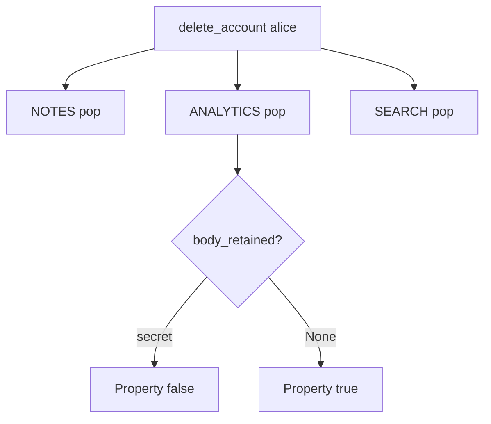

# 5.1-LO-04 — Walk the inventory in the same delete use-case

**Kind:** design-exercise
**Loop step:** 4 Build
**Standards:** OWASP ASVS 5.0.0 (final) `v5.0.0-14.2.4`.

## Structural means every listed copy is gone

`delete_account` must pop `NOTES`, `ANALYTICS`, and `SEARCH`. Structural means the use-case owns the graph — not a privacy PDF, not “anonymize the user id,” not encryption of a kept row.

## Mental model: one call, three pops



Fail-safe: if a listed copy cannot be reached, **do not claim delete complete** (refuse the use-case or alert). Do not fail open by returning 200 while analytics remains.

## Why this restores the cell

| After the fix | Must be true |
|---|---|
| After delete | `body_retained` and `search_retained` are None |
| Before delete | analytics body still present (honest product) |

## What this is not

`DELETE FROM notes` only. Encrypted warehouse you still keep. Backup purge (named 5.5). Mobile cache (8.2).

## Practice

Name copies and predicates. Run:

```
python3 -m pytest labs/5.1/5.1-lab/tests --impl fixed
```

Must pass.

## Transfer

Clinic: delete patient and appointment-card notes in one runbook.

## Residual risk

Legal hold (E6); backups; scheduled purge (`v5.0.0-14.2.7` Level 3 advanced) is not this fixture.
