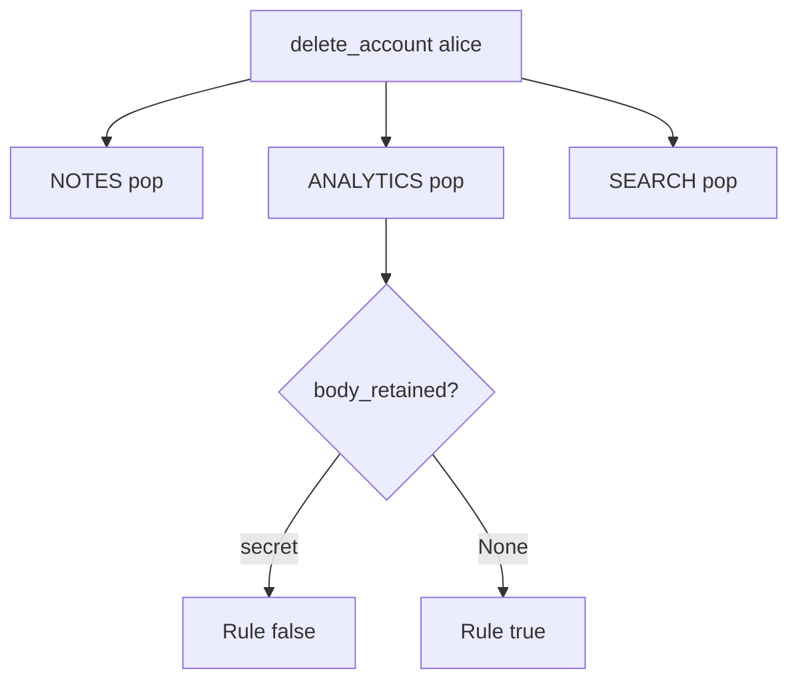

# Walk the inventory in the same delete

**Kind:** design-exercise
**Loop step:** 4 Build

## The rule

A later warehouse job does not empty analytics. Anonymizing the user id keeps the body. Encrypting a kept row keeps the body. A privacy PDF is a document. `DELETE FROM notes` alone is not `body_retained`.

What has to change: `delete_account` **pops `NOTES`, `ANALYTICS`, and `SEARCH`**. Walk the inventory in the same use-case. Same delete. Not a follow-up ticket.

Restore bodies with this: one call walks every listed copy. When a listed copy cannot be reached, **do not claim delete complete** (refuse the use-case or alert). Do not fail open by returning 200 while analytics remains.

## Picture: one call, three pops



Delete has to pop all three maps. Replicas, support tickets, and backups still have to be on the inventory (named later). A privacy-law footer does not pop `ANALYTICS`. A privacy-framework “control” label is an outcome name, not this check.

Sensitive data must not be sent to an untrusted second party. The check is the deletion half of that sentence: if analytics already has the body, delete must still walk it. A scheduled automatic deletion job is advanced work, not this check.

## What the repaired files must show

Do not treat `fixed/lifecycle.py` as a production warehouse.

| After the fix | Must be true |
|---|---|
| After delete | `body_retained` and `search_retained` are None |
| Before delete | analytics body still present (honest product) |

If you cannot reach a listed copy, the answer is “delete is not complete.” A dashboard that still showed “account deleted” does not finish delete.

## What this is not

- `DELETE FROM notes` only.
- Encrypted warehouse you still keep.
- Backup purge (later).
- A phone's offline cache (later).
- Anonymize-id-keep-body.
- A contract signature.
- A scheduled warehouse job as a substitute for this call.

## What the tool cannot do

- Anonymizing the user id while keeping the body still fails `body_retained`.
- Backups and point-in-time restore are later; these local files do not erase write-ahead logs.
- Mobile offline copies wait.
- Legal hold is a named exception with an owner, not a silent keep.
- Scheduled warehouse jobs are not this call.

## Can people still use it

If you show “account deleted,” say it in text a screen reader can speak. Do not encode deleted as color only. The announcement is not the purge.

## Practice

Name the copies and the checks (`body_retained is None` and `search_retained is None`). Run:

```text
python3 -m pytest labs/5.1/5.1-lab/tests --impl fixed
```

## Use it somewhere new

Delete the patient row and the appointment-card notes in one runbook, not a later ticket.

## What can still go wrong

Legal hold. Backups. Support-ticket paste. A scheduled purge used as a substitute for the use-case.

## What this page is not doing

Do not connect a live warehouse. A privacy-policy PDF does not mark you finished.
