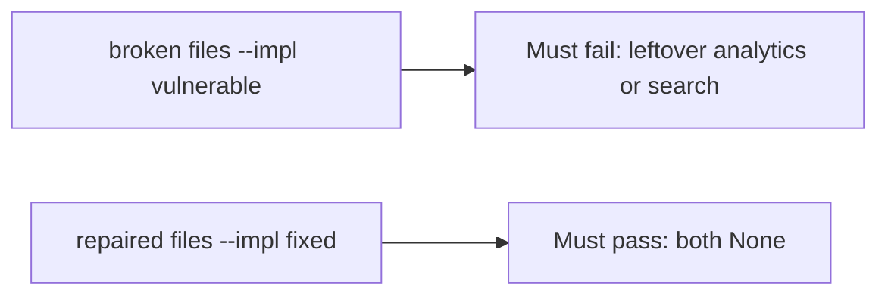

# A leftover analytics or search copy must fail the check

**Kind:** verification-lab
**Loop step:** 5 Verify

## Check it

“We have a contract” is not evidence. “The notes row is gone” is a tool observation. The check is: after `delete_account("alice")`, `body_retained("alice") is None` and `search_retained("alice") is None`. That observation must be **false** on the broken files (the helper still returns `"secret"`) and **true** on the repaired files.

## Picture: leftover analytics or search must fail the check

Asserting the notes row is gone can still hide that the warehouse still holds the body.



If both pass, you are not looking at `body_retained` after delete.

## What the check has to show

| Mode | Must show for this topic |
|---|---|
| Normal | Analytics present before delete (`test_active_account_analytics_present`; may pass on both) |
| Wrong input / abuse | Analytics and search bodies gone after delete; broken files must fail |
| Failure | Honest-path tests may pass on both; you still need the leftover-copy tests |
| Not claimed | Backups (later); a phone's offline cache (later); scheduled warehouse jobs |

The test `test_deleted_account_leaves_no_analytics_body` calls `delete_account` then `body_retained`. That check is there so a leftover warehouse body still fails.

Searching for `DELETE FROM notes` without calling `body_retained` is not evidence. This practice never opens a live warehouse.

```text
python3 -m pytest labs/5.1/5.1-lab/tests --impl vulnerable
python3 -m pytest labs/5.1/5.1-lab/tests --impl fixed
```

Map the test to the deleted-alice × leftover-analytics row you wrote. If the broken files do not fail the leftover-body assertion, the lab is miswired — fix the wiring, not the assertion. A setup error is not proof the rule holds.

## What the tests do not prove

- Backup restore (later)
- Mobile offline copies (later)
- Automatic retention schedule (advanced; not this check)
- Legal-hold exception handling (named later)

## Practice

Do not treat a grep for `DELETE FROM notes` as the check. Call `body_retained`.

## Use it somewhere new

Clinic appointment card. Asserting HTTP 200 on delete is not retention evidence. Do not run a test that hits a live warehouse.

## What this page is not doing

Do not add a live warehouse dump. Do not log leftover bodies. Answer keys are not on this site.
