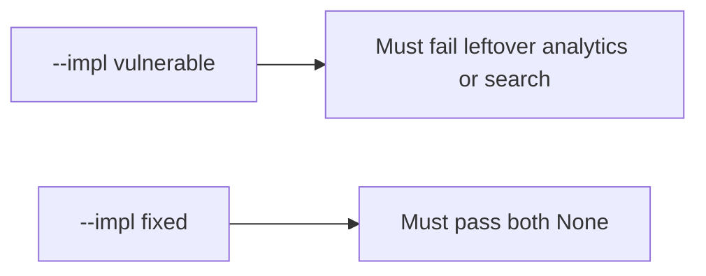

# 5.1-LO-05 — Evidence is body_retained None after delete, then a passing pair

**Kind:** verification-lab
**Loop step:** 5 Verify
**Standards:** OWASP ASVS 5.0.0 (final) `v5.0.0-14.2.4`.

## An invariant that cannot fail a test is still a slogan

“We have a DPA” is not evidence. “Notes row is gone” is a mechanism observation. The oracle is: after `delete_account("alice")`, `body_retained("alice") is None` and `search_retained("alice") is None`. That observation must be **false** on `--impl vulnerable` (returns `"secret"`) and **true** on `--impl fixed`.

## Mental model: vulnerable must fail: leftover analytics or search

The failing observation on `--impl vulnerable` is **leftover analytics or search**. A passing collection count is not this cell.



| Mode | Must show for this module |
|---|---|
| Normal | analytics present before delete (`test_active_account_analytics_present`; may pass on both) |
| Negative / abuse | analytics and search bodies gone after delete; vulnerable must fail |
| Not claimed | Backups (5.5); mobile cache (8.2); scheduled warehouse jobs |

Lab tests in `labs/5.1/5.1-lab/tests/test_property.py`. `test_deleted_account_leaves_no_analytics_body` is a **forbidden-outcome** test: a leftover warehouse body is not allowed to count as a passing control.

```text
python3 -m pytest labs/5.1/5.1-lab/tests --impl vulnerable
python3 -m pytest labs/5.1/5.1-lab/tests --impl fixed
```

Honest-path tests may pass on both implementations. That does not excuse the leftover-copy tests. If vulnerable does not fail `body_retained`, the lab is miswired—fix the wiring, not the assertion.

## What the tests do not prove

- Backup restore (5.5)
- Mobile offline copies (8.2)
- Automatic retention schedule (`v5.0.0-14.2.7` Level 3 advanced)
- Legal-hold exception handling (E6)

Record those as residuals or later modules, not as silent passes.

## Practice

Execute both implementations this session. Write the fail/pass pair next to the matrix row. Reject a “test” that only greps `DELETE FROM notes` without calling `body_retained`.

## Transfer

Clinic appointment card. A test that only asserts HTTP 200 on delete is not retention evidence (see 9.3). A test that hits a live warehouse is out of scope.

## Non-goals

Do not add a live warehouse dump. Do not log leftover bodies. Keys stay out of this file.
