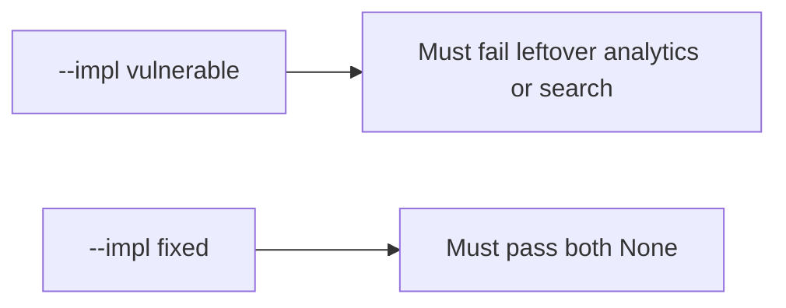

# 5.1-LO-05 — Evidence is body_retained None after delete, then a passing pair

**Kind:** verification-lab
**Loop step:** 5 Verify
**Standards:** OWASP ASVS 5.0.0 (final) `v5.0.0-14.2.4`.

## An invariant that cannot fail a test is still a slogan

“We have a DPA” is not evidence. The oracle is the local pair.

## Mental model: vulnerable must fail: leftover analytics or search

The failing observation on `--impl vulnerable` is **leftover analytics or search**. A passing collection count is not this cell.



| Case | Must show |
|---|---|
| Negative / abuse | analytics and search bodies gone after delete |
| Normal | analytics present before delete |
| Not claimed | Backups; mobile cache; scheduled warehouse jobs |

Lab tests in `labs/5.1/5.1-lab/tests/test_property.py`:

```
python3 -m pytest labs/5.1/5.1-lab/tests --impl vulnerable
python3 -m pytest labs/5.1/5.1-lab/tests --impl fixed
```

## What the tests do not prove

- Backup restore (5.5)
- Mobile offline copies (8.2)
- Automatic retention schedule (`v5.0.0-14.2.7` Level 3 advanced)

## Practice

Execute both implementations. Map each test to an LO-02 cell.

## Transfer

Clinic appointment card. A test that only asserts HTTP 200 on delete is not retention evidence (see 9.3).
