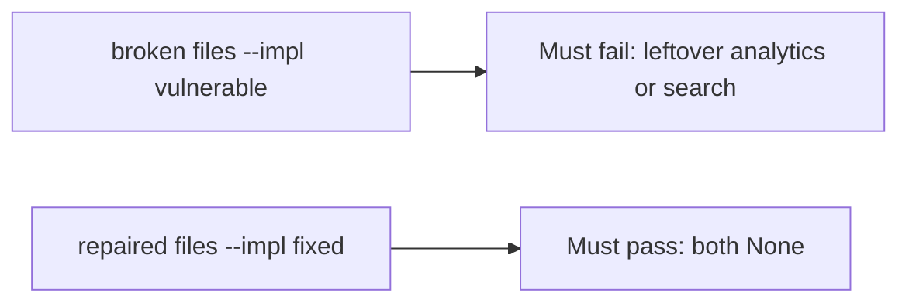

# Fail on the broken files, then pass on the repaired ones

**Kind:** verification-lab
**Loop step:** 5 Verify

## If you cannot test it, it is still a slogan

“We have a contract” is not evidence. “The notes row is gone” is a tool observation. The check is: after `delete_account("alice")`, `body_retained("alice") is None` and `search_retained("alice") is None`. That observation must be **false** on the broken files (the helper still returns `"secret"`) and **true** on the repaired files.

## Picture: leftover analytics or search must fail the check

A test that only asserts the notes row is gone can pass while the warehouse still holds the body. This check asks whether leftover analytics or search after delete still counts as a passing control. Broken must fail that question. Repaired must pass it.



If both pass, the test is not looking at `body_retained` after delete. If both fail, the fix is not structural or the check is wrong.

## Four modes, even for one body

| Mode | Must show for this topic |
|---|---|
| Normal | Analytics present before delete (`test_active_account_analytics_present`; may pass on both) |
| Wrong input / abuse | Analytics and search bodies gone after delete; broken files must fail |
| Failure | Honest-path tests may pass on both; that does not excuse the leftover-copy tests |
| Not claimed | Backups (later); a phone's offline cache (later); scheduled warehouse jobs |

The file is `labs/5.1/5.1-lab/tests/test_property.py`. The test `test_deleted_account_leaves_no_analytics_body` calls `delete_account` then `body_retained`. That is a **what-must-not-happen** test: a leftover warehouse body is not allowed to count as a passing control.

A test that only asserts HTTP 200 is not this topic's evidence. A test that only greps `DELETE FROM notes` without calling `body_retained` is not this topic's evidence. This practice never opens a live warehouse.

```text
python3 -m pytest labs/5.1/5.1-lab/tests --impl vulnerable
python3 -m pytest labs/5.1/5.1-lab/tests --impl fixed
```

Map the test to the deleted-alice × leftover-analytics row you wrote. If the broken files do not fail the leftover-body assertion, the lab is miswired — fix the wiring, not the assertion. An environment error is not security evidence.

## What the tests do not prove

- Backup restore (later)
- Mobile offline copies (later)
- Automatic retention schedule (advanced; not this pytest)
- Legal-hold exception handling (named later)

Record those as leftover or later topics, not as silent passes.

## Practice

Run both this session:

```text
python3 -m pytest labs/5.1/5.1-lab/tests --impl vulnerable
python3 -m pytest labs/5.1/5.1-lab/tests --impl fixed
```

Paste nothing from answer keys. Write fail/pass into your notes next to the matrix row. Reject a “test” that only greps `DELETE FROM notes` without calling `body_retained`.

## Use it somewhere new

Clinic appointment card. A test that only asserts HTTP 200 on delete is not retention evidence. A test that hits a live warehouse is out of scope.

## What this page is not doing

Do not add a live warehouse dump. Do not log leftover bodies. Answer keys stay out of this file.
