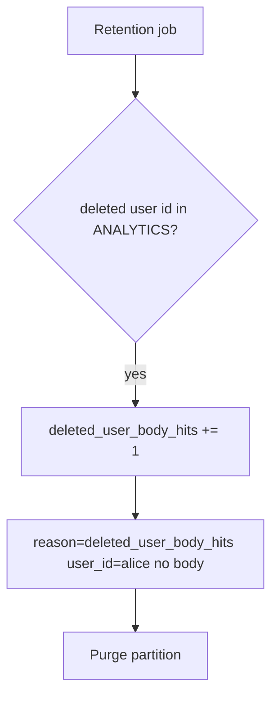

# 5.1-LO-06 — Detect leftover bodies; purge without logging them

**Kind:** operations-exercise
**Loop step:** 6 Operate
**Standards:** NIST CSF 2.0 (final) DE/RS/RC as outcome labels; OWASP ASVS 5.0.0 (final) `v5.0.0-14.2.4`. CSF names outcomes; it does not walk the deletion graph.

## Prevention is not absolute

A replica warehouse, a backup, or a support ticket can still hold the body after `delete_account` was “fixed once.” Pair detect and recover. Do not log bodies (3.1). Do not paste the chart into the ticket.

## Mental model: hunt ids, not bodies



| Outcome | This module |
|---|---|
| Detect | `deleted_user_body_hits`; warehouse SLA for purge |
| Signal | user id, store name, request id; never the body |
| Recover | Purge partitions; named legal-hold owner |
| Residual | Backups still contain the row (5.5); screenshots you cannot purge |

CSF 2.0 Detect / Respond / Recover name outcomes. They do not prove `v5.0.0-14.2.4`. A SIEM product name is not the property. Re-run `test_deleted_account_leaves_no_analytics_body` after any copy is added; a green “GDPR mode” tile is not that pytest. Search, analytics, and the appointment-card analogue are other paths of the same cell — inventory them before claiming Recover.

## Framework defaults versus the operate guarantee

A warehouse dashboard will show “PII redacted” and stay silent when the body column still holds `secret`. Detection must observe **user id still present in a listed store**, not a privacy-policy checkbox. If the alert includes the note body, you have opened a 3.1 cell.

## Practice

Write one log line you would accept. Tie it to `labs/5.1/5.1-lab`.

```text
log_denied reason=deleted_user_body_hits store=analytics user_id=alice request_id=req_51lc
```

Reject any line that includes a note body, a personal email, or a “GDPR handled” slogan.

## Transfer

Clinic: detect appointment-card notes after patient delete; do not paste the chart into the ticket. Do not query a live warehouse.

## Usability

If a human sees “account deleted,” announce it (WCAG 2.2 Success Criterion 4.1.3). A silent 200 that left analytics in place is a false completion, not a polish item.

## Non-goals

SIEM product names are not the property. Live warehouse dumps are out of scope. Gates 0–10 stay not-attempted.
