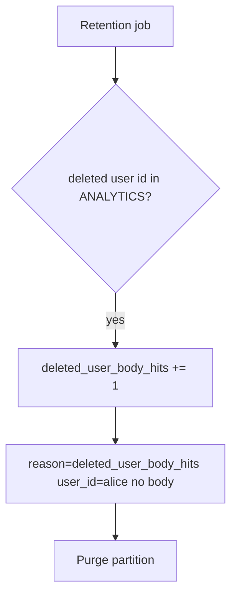

# Notice leftover bodies; purge without logging them

**Kind:** operations-exercise
**Loop step:** 6 Operate

## Fixing it once is not enough

A replica warehouse, backup, or support ticket can still hold the body after `delete_account` pops the maps. Notice that leftover, contain the replica, purge the body, and do not log note bodies.

Keep the chart and leftover bodies out of the ticket.

## Picture: hunt ids, not bodies

After delete, a leftover body must not put leftover notes in the pager. Then purge the partition.



A log product does not walk the deletion graph.

## Signals that do not become a second leak

| Outcome | This topic |
|---|---|
| Notice | `deleted_user_body_hits`; warehouse time-to-purge |
| What the line holds | user id, store name, request id — **never** the body |
| Respond | Purge partitions; stop the replica that still has `alice` |
| Recover | Purge partitions; a named legal-hold owner; re-run `test_deleted_account_leaves_no_analytics_body` |
| Leftover | Backups still contain the row (later); screenshots you cannot purge |

```text
log_denied reason=deleted_user_body_hits store=analytics user_id=alice request_id=req_51lc
```

Keep leftover chart text, a personal email, and “privacy law handled it” off that sample.

Paste a note body into the deletion alert and the pager now stores leftover analytics text.

A dashboard tile that says “privacy mode” does not wipe leftover notes. If a replica warehouse still has `alice`, treat it as the same leftover body, not a separate “eventual consistency” pass. Search, analytics, and the appointment-card analogue still hold the body; do not send “account deleted” until those copies are gone. That mail is not recovery.

## What the framework does vs what you still have to check

A warehouse dashboard will show “personal data redacted” and stay silent when the body column still holds `secret`. Detection must observe **user id still present in a listed store**, not a privacy-policy checkbox. If the alert includes the note body, you have opened a secrecy leak too.

## Can people still use it

If a human sees “account deleted,” announce it in text a screen reader can speak. A silent 200 that left analytics in place is a false completion, not a polish item.

## Practice

Log ids, a reason, and the store name — never the leftover body. A note body, a personal email, or a “privacy law handled” slogan would reprint the leftover body.

## Use it somewhere new

Notice appointment-card notes after patient delete; do not paste the chart into the ticket. Do not query a live warehouse.

## What this page is not doing

Do not run live queries against a production warehouse. Answer keys are not on this site.
