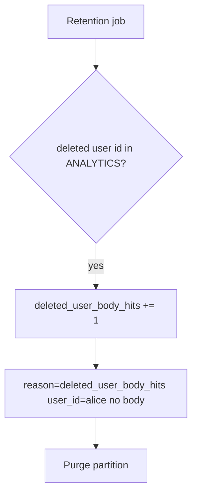

# 5.1-LO-06 — Detect leftover bodies; purge without logging them

**Kind:** operations-exercise
**Loop step:** 6 Operate
**Standards:** NIST CSF 2.0 (final) DE/RS/RC as outcome labels; OWASP ASVS 5.0.0 (final) `v5.0.0-14.2.4`.

## Prevention is not absolute

A replica warehouse, a backup, or a support ticket can still hold the body. Pair detect and recover. Do not log bodies (3.1).

## Mental model: hunt ids, not bodies



| Outcome | This module |
|---|---|
| Detect | `deleted_user_body_hits`; warehouse SLA for purge |
| Signal | user id, store name; never the body |
| Recover | Purge partitions; named legal-hold owner |
| Residual | Backups still contain the row (5.5) |

## Practice

Write one log line you would accept. Tie it to `labs/5.1/5.1-lab`.

```
log_denied reason=deleted_user_body_hits store=analytics user_id=alice request_id=req_51lc
```

Reject any line that includes a note body or a personal email.

## Transfer

Clinic: detect appointment-card notes after patient delete; do not paste the chart into the ticket.

## Non-goals

SIEM product names are not the property.
