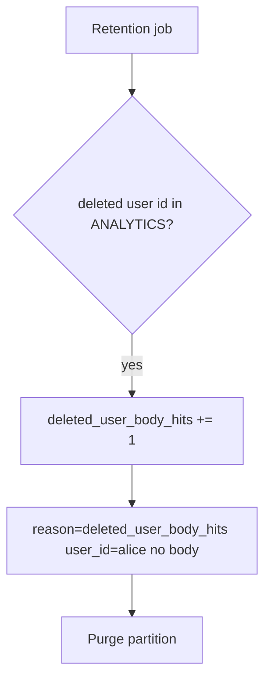

# Notice leftover bodies; purge without logging them

**Kind:** operations-exercise
**Loop step:** 6 Operate

## Fixing it once is not enough

Even after `delete_account` was fixed once, a replica warehouse, a backup, or a support ticket can still hold the body. Running it for real is the rest of the loop: notice, contain, purge, and refuse to “help” by logging note bodies.

Do not paste the chart into the ticket. Do not log bodies.

## Picture: hunt ids, not bodies

A leftover body after delete is a notice-and-recover problem, not a licence to quote notes in the paging channel. Notice names the event. Recover purges the partition. Neither reprints the body.



A log product does not walk the deletion graph.

## Signals that do not become a second leak

| Outcome | This topic |
|---|---|
| Notice | `deleted_user_body_hits`; warehouse time-to-purge |
| What the line holds | user id, store name, request id — **never** the body |
| Respond | Purge partitions; stop the replica that still has `alice` |
| Recover | Purge partitions; a named legal-hold owner; re-run `test_deleted_account_leaves_no_analytics_body` |
| Leftover | Backups still contain the row (later); screenshots you cannot purge |

A log line a reviewer can accept looks like:

```text
log_denied reason=deleted_user_body_hits store=analytics user_id=alice request_id=req_51lc
```

Not: a note body, a personal email, or “privacy law handled it.”

If your alert includes a note body, you have opened a second leak in the paging channel.

A green dashboard tile that says “privacy mode” is not that check. If a replica warehouse still has `alice`, treat it as the same leftover body, not a separate “eventual consistency” pass. Search, analytics, and the appointment-card analogue are other paths of the same leftover — inventory them before claiming recover. An “account deleted” email is not recovery.

## What the framework does vs what you still have to check

A warehouse dashboard will show “personal data redacted” and stay silent when the body column still holds `secret`. Detection must observe **user id still present in a listed store**, not a privacy-policy checkbox. If the alert includes the note body, you have opened a secrecy leak too.

## Can people still use it

If a human sees “account deleted,” announce it in text a screen reader can speak. A silent 200 that left analytics in place is a false completion, not a polish item.

## Practice

Write one log line you would accept in review (ids, reason, store name, no body). Tie it to `labs/5.1/5.1-lab`. Reject any line that includes a note body, a personal email, or a “privacy law handled” slogan.

## Use it somewhere new

A clinic example: notice appointment-card notes after patient delete; do not paste the chart into the ticket. Do not query a live warehouse.

## What this page is not doing

A vendor name is not this week's rule. Do not run live queries against a production warehouse. Answer keys are not on this site.
