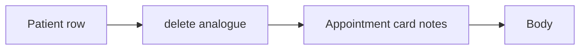

# An appointment card that still holds notes

**Kind:** transfer-challenge
**Loop step:** 7 Transfer

## Use it somewhere new

You get a **clinic record delete**. A patient row and an appointment card sit next to each other.

After `delete_account("alice")`, `body_retained("alice")` is None. For a clinic, every copy of the notes must die in the same delete.

## Picture: the card is another copy

The patient is alice after delete. Deleting the patient row does not authorize leaving the appointment-card notes alive. A “right to be forgotten” banner does not purge the copies.

| Notes app | Clinic sketch |
|---|---|
| `alice` note body | Appointment-card notes |
| `delete_account` | Patient-delete analogue |
| `body_retained` after delete | Card notes still present after patient row gone |
| Analytics insider; export buyer | Insider analytics; partner CSV — **not** a live clinic |
| Search copy | Analytics export that still holds the body |

If delete only hits the patient row, the card still retains. An HTTP 200 on `/patients/{id}` and a privacy banner do not pop the card. Encrypting the card you still keep is secrecy, not this privacy check. A privacy-framework “control” label is an outcome name, not the check.

After patient delete, appointment-card notes and the analytics export still have to be None. Copying a delete handler that only drops the patient row leaves the card unused as a copy. The local check is `test_deleted_account_leaves_no_analytics_body` plus the search-copy deny — on local files, not a live warehouse.

## Write this for leftover card notes

1. who might try (insider analytics; partner CSV — **not** a live clinic);
2. what you trust (which delete path is trusted; the contract PDF is not);
3. what must not happen (`body_retained` true after delete);
4. leftover card notes after delete holds to **local** files (never on the real clinic);
5. leftover (backups; phone cache; legal hold);
6. whether a human-read “account deleted” status must not use color as the only cue.

## What is not good enough

| Reject | Why |
|---|---|
| “We encrypted analytics” as deletion | Privacy is not secrecy |
| Live clinic warehouse | Course rules |
| Privacy-policy PDF as the rule | Tool theater |
| HTTP 200 as deletion evidence | Wrong observation |
| Anonymize-id-keep-body | Body still retained |

## Practice

Walk every leftover copy of the appointment card. Keep the answer keys closed. The only running system you may break is `labs/5.1/5.1-lab`. Do not query a live warehouse or paste a chart into a ticket.

## What this page is not doing

Do not try live-target dumps. Do not use real patient notes. This page does not finish a check-in.
