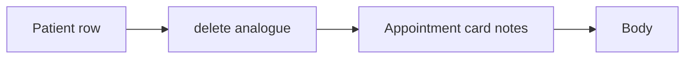

# 5.1-LO-07 — Transfer: appointment card still holds notes

**Kind:** transfer-challenge
**Loop step:** 7 Transfer
**Standards:** NIST Privacy Framework 1.0 (final); OWASP ASVS 5.0.0 (final) `v5.0.0-14.2.4`. Privacy Framework 1.1 remains **draft**.

## Change the workplace; keep every-copy-must-die

Do not answer with a Top 10 / CWE / scanner as the definition of security. The SecureCollab sentence was: after `delete_account("alice")`, `body_retained("alice")` is None. Rewrite it for a clinic without changing the fork.

**Prompt:** Clinic: appointment card with notes after the patient record is deleted.

**Product sketch:** EHR-lite with a patient row, an appointment card, and an analytics export.

Rewrite the SecureCollab sentence. Include:

1. attacker capabilities (insider analytics; partner CSV — not a live clinic);
2. trust assumptions (which delete use-case is TCB; the DPA is not);
3. forbidden outcome (`body_retained` true after delete, not “HIPAA”);
4. a test idea on a **local** fixture only (patient delete leaves card notes None);
5. residual (backups; mobile cache; legal hold);
6. WCAG 2.2 on the human delete path (usable “account deleted” status — 1.4).

## Mental model: card is another copy

If delete only hits the patient row, the card still retains. FastAPI 200 on `/patients/{id}` and a “right to be forgotten” banner do not pop the card. Encryption of the card you still keep is confidentiality, not this privacy cell. Privacy Framework 1.0 Control is an outcome label, not the pytest.

The clinic rewrite still has to keep the SecureCollab fork: after patient delete, appointment-card notes and the analytics export are None. Copying a delete handler that only drops the patient row leaves the card unused as a copy. The local pytest analogue is `test_deleted_account_leaves_no_analytics_body` plus the search-copy deny — on a fixture, not a live warehouse.

## What graders reject

| Reject | Why |
|---|---|
| “We encrypted analytics” as deletion | Privacy ≠ confidentiality |
| Live clinic warehouse | Lab policy |
| Privacy-policy PDF as the property | Mechanism theater |
| HTTP 200 as deletion evidence | Wrong observation |
| Anonymize-id-keep-body | Body still retained |

## Practice

One page. No keys. `labs/5.1/5.1-lab` is the only running system you may break. Do not query a live warehouse or paste a chart into a ticket.

## Non-goals

Live-target dumps. Real patient notes. Claiming Gate 5 from this page.
