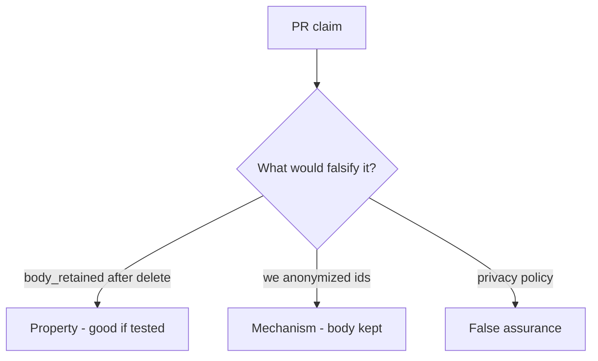

# 5.1-LO-08 — Review leftover analytics as a PR, not a DPA ticket

**Kind:** code-review
**Loop step:** Review
**Standards:** OWASP ASVS 5.0.0 (final) `v5.0.0-14.2.4`.

## Review the fixture as if it were SecureCollab deletion

Review `labs/5.1/5.1-lab/vulnerable/` as a SecureCollab PR. Intended findings live only in `content/assessment/keys/5.1.md` — not here.

## Mental model: delete_account only NOTES.pop

Start with this seeded smell: **`delete_account` only `NOTES.pop`**. Label it property, mechanism, or false assurance before you accept the PR.

Seeded smells (label them yourself; do not open the keys file):

- `delete_account` only `NOTES.pop`
- Analytics “immutable for ML” without exception record
- No test `body_retained` after delete
- Privacy policy PDF as the control

Also reject: client trust, closing findings without retest, keys in lessons, real PII in fixtures.

## Misconceptions

- Encryption makes retention OK
- Privacy equals confidentiality
- GDPR text in footer is the invariant

## Practice

Write three review notes. Tie at least one to `test_deleted_account_leaves_no_analytics_body`.

## Transfer

Clinic PR that “deletes the patient” without walking the appointment-card notes is incomplete.
