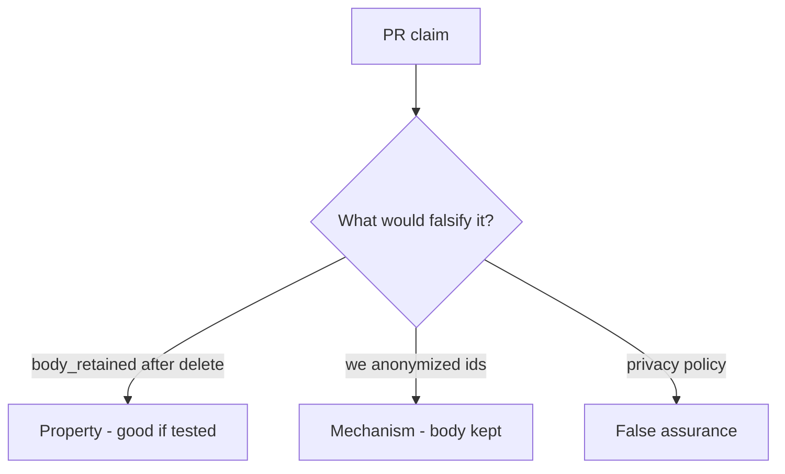

# 5.1-LO-08 — Review leftover analytics as a PR, not a DPA ticket

**Kind:** code-review
**Loop step:** Review
**Standards:** OWASP ASVS 5.0.0 (final) `v5.0.0-14.2.4`.

## Review the fixture as if it were SecureCollab deletion

Review `labs/5.1/5.1-lab/vulnerable/` as a SecureCollab PR. Your job is not to count suspicious lines. Reconstruct whether `body_retained("alice")` is still `"secret"` after `delete_account("alice")`, compare that with the module invariant, and write changes a developer can verify.

Intended findings live only in `content/assessment/keys/5.1.md` — not here. Do not open the keys file until your review has been evaluated.

## Mental model: delete_account only NOTES.pop

Start with this seeded smell: **`delete_account` only `NOTES.pop`**. Label it property, mechanism, or false assurance before you accept the PR.

Classification starts at the protected effect (analytics and search bodies None after delete). Everything that is not a pop of that copy in the same use-case is a candidate leftover path. “We anonymized user ids” while the body column remains is the same smell, not a different finding class.

## Seeded smells (label them yourself)

- `delete_account` only `NOTES.pop`
- Analytics “immutable for ML” without exception record
- No test `body_retained` after delete
- Privacy policy PDF as the control

Also reject: client trust; closing findings without re-running `test_deleted_account_leaves_no_analytics_body`; keys in lessons; real PII in fixtures; encryption of a kept warehouse as deletion.

## Misconceptions this module refuses

- Encryption makes retention OK
- Privacy equals confidentiality
- GDPR text in footer is the invariant
- Postgres DELETE is warehouse DELETE
- HTTP 200 on `/account` is the graph

## Practice

Write three review notes a maintainer could act on. Each note: observation, property or false assurance, suggested structural change, residual you will **not** delete. Tie at least one to `test_deleted_account_leaves_no_analytics_body`.

## Transfer

Clinic PR that “deletes the patient” without walking the appointment-card notes is an incomplete mediation review. Name the independent falsehood that would still keep `body_retained` None.

## Non-goals

Do not merge by adding a comment “will add warehouse purge later.” That comment is a residual without an owner. Do not dump a live warehouse to prove the finding.
