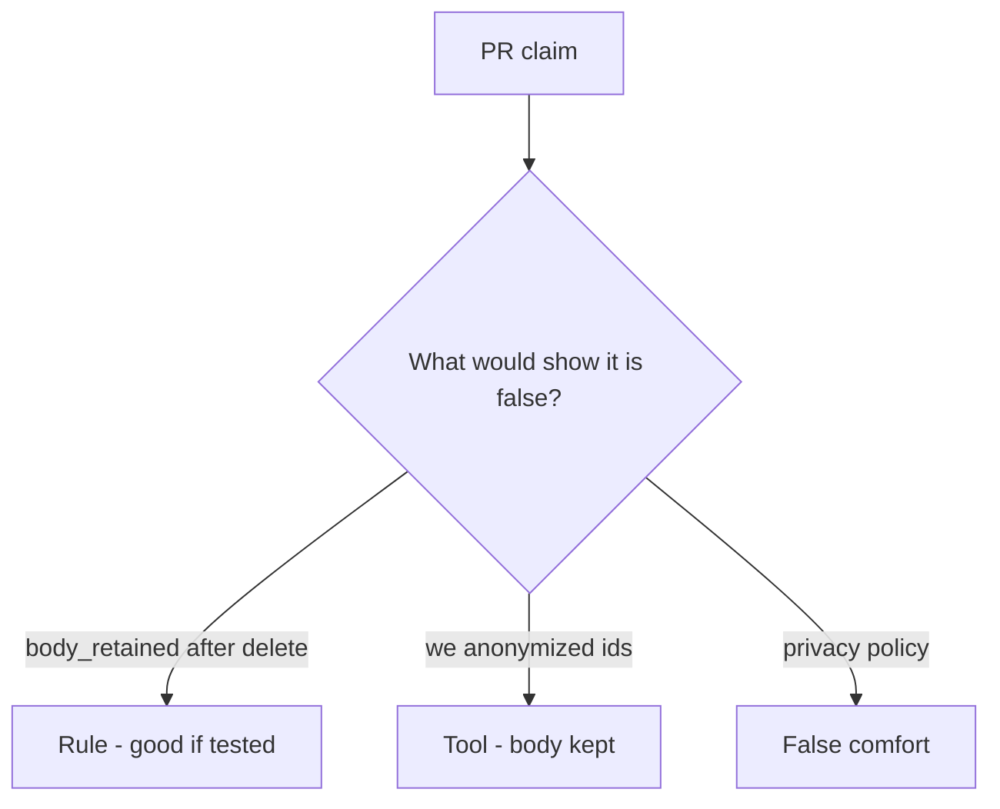

# Review of leftover analytics

**Kind:** code-review
**Loop step:** Review

Intended findings live only in the answer-key folder — not here. Do not open that file until your review has been evaluated.

## What you are reviewing

A colleague ships notes-app deletion. Your job is to label each claim **rule**, **tool**, or **false comfort**, and to say whether `body_retained("alice")` is still `"secret"` after `delete_account("alice")` if they ship. Start at leftover analytics after delete, not at a scanner color or a contract ticket.

The folder `labs/5.1/5.1-lab/vulnerable/` is the change. The check you already ran (`test_deleted_account_leaves_no_analytics_body`) is the rule test. A comment “will add warehouse purge later” is not.

## Picture: problems to find (name them yourself)

Start with this seeded smell: **`delete_account` only `NOTES.pop`**. Label it rule, tool, or false comfort before you accept the change.

Hold onto this: analytics and search bodies are None after delete. If that same delete is missing a pop of those copies, you still have a leftover path. “We anonymized user ids” while the body column remains is still the same problem.

## Seeded smells (label them yourself)

- `delete_account` only `NOTES.pop`
- Analytics “immutable for ML” without an exception record
- No test `body_retained` after delete
- Privacy policy PDF as the control

Also reject: trusting the client; closing findings without re-running `test_deleted_account_leaves_no_analytics_body`; keys in learner notes; real people's data in the practice files; encryption of a kept warehouse as deletion.

## Common mix-ups

- Encryption makes retention OK
- Privacy equals secrecy
- A privacy-law footer is the rule
- A database DELETE is warehouse DELETE
- HTTP 200 on `/account` is the graph

## Practice

Write three review notes a maintainer could act on. Each note: what you saw, rule or false comfort, suggested structural change, leftover you will **not** delete. Tie at least one note to `test_deleted_account_leaves_no_analytics_body`. Do not open the keys file.

## Use it somewhere new

Clinic change that “deletes the patient” without walking the appointment-card notes is an incomplete review of leftover copies. Name the independent falsehood that would still keep `body_retained` None.

## Can people still use it

If the dashboard shows an “account deleted” badge, do not encode it as color only. That is a cue for operators, not the purge.

## What this page is not doing

Do not merge by adding a comment “will add warehouse purge later.” That comment is leftover without an owner. Do not dump a live warehouse to prove the finding.
