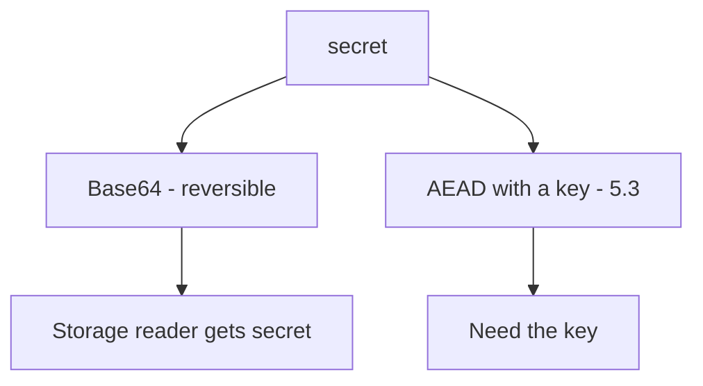
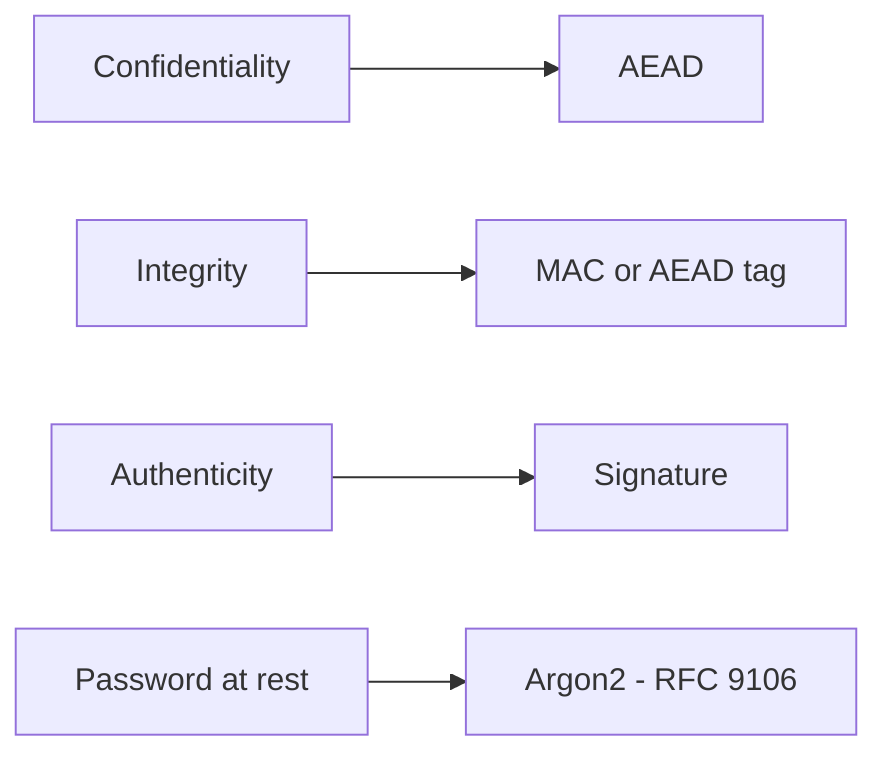

# 5.2-LO-01 — Encoding is not confidentiality

**Kind:** concept-model
**Loop step:** 1 Property
**Standards:** OWASP ASVS 5.0.0 (final) `v5.0.0-11.2.1`, `v5.0.0-11.3.2`, `v5.0.0-11.3.3`; `v5.0.0-11.3.4` and `v5.0.0-11.1.4` are **Level 3, advanced**. RFC 9106 Argon2 (final) is for **passwords**, not this field. Fernet still needs 5.3 key storage.

## The claim this module owns

SecureCollab Phase 1 stores a note-body stand-in at rest. Confidentiality vs an honest storage observer is not “we Base64ed it.” Encoding, hex, and rot13 are reversible without a key. HTTPS (5.4) does not encrypt the column. Password hashing (RFC 9106) is a different property for a different field.

> `protect("secret")` must not round-trip as Base64 of the plaintext. `looks_encrypted` is a teaching flag, not AES-GCM. The fixed `aesgcm:` prefix in the lab is a **stand-in**, not a cipher you should ship.

The forbidden outcome is **protect() reversible as Base64 to `secret`**. That is a 1.1 confidentiality failure: any reader of the stored field gets the body.

ASVS `v5.0.0-11.2.1` wants industry-validated implementations. `v5.0.0-11.3.2` / `v5.0.0-11.3.3` want approved AEAD (AES-GCM class), not ECB and not encoding. `v5.0.0-11.4.2` is password KDF — named so you do **not** apply it to note bodies. `v5.0.0-11.3.4` (nonce uniqueness) and `v5.0.0-11.1.4` (PQC migration plan) are **Level 3 (advanced)**.

## Mental model: encoding vs encryption



The attacker is an operator who can read the column, or a stolen disk of the lab dict. Trusting the column name `encrypted_body` is not a TCB.

**Mechanism (not the property):** Fernet, libsodium, or “we enabled at-rest encryption on the volume.”

## Mental model: pick the property first



A stronger algorithm does not fix a missing key story (5.3) or nonce reuse (`v5.0.0-11.3.4` advanced).

## Root cause vs impact vs prevention vs detection vs recovery

| Slice | For this property |
|---|---|
| Root cause | Mechanism name “encrypted” applied to encoding |
| Preconditions | `protect` returns Base64 of plaintext |
| Trigger | Storage observer reads the field |
| Impact | Confidentiality of the stored secret |
| Prevention | Standard AEAD with a managed key; tests forbid Base64 identity |
| Detection | Known-plaintext Base64 round-trip in CI |
| Recovery | Rotate keys; re-protect; treat as leak |

## Framework defaults versus the confidentiality guarantee

passlib/bcrypt is for passwords, not note bodies. Disk encryption is not application-level confidentiality vs a DB admin. Oracle: `labs/5.2/5.2-lab`. No live KMS.

## Mechanism limits

- AES-GCM with nonce reuse is not this lab — name the misuse; do not paste attack scripts.
- Key in the same row; client-only “encryption” with the key in the bundle (8.1).
- JWT is a format (4.3), not encryption.

## Practice

Table: property vs algorithm vs what it is *not* for. Then run:

```
python3 -m pytest labs/5.2/5.2-lab/tests --impl vulnerable
python3 -m pytest labs/5.2/5.2-lab/tests --impl fixed
```

The first command must fail. The second must pass.

## Transfer

Clinic: SSN column labeled “encrypted” that is Base64.

## Non-goals

Live ciphertext attacks, rolling a cipher, real SSN values. Gates 0–10 and milestones M0–M5 stay **not-attempted**. Answer keys are not in this file.
