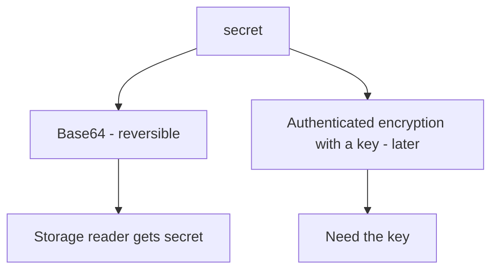
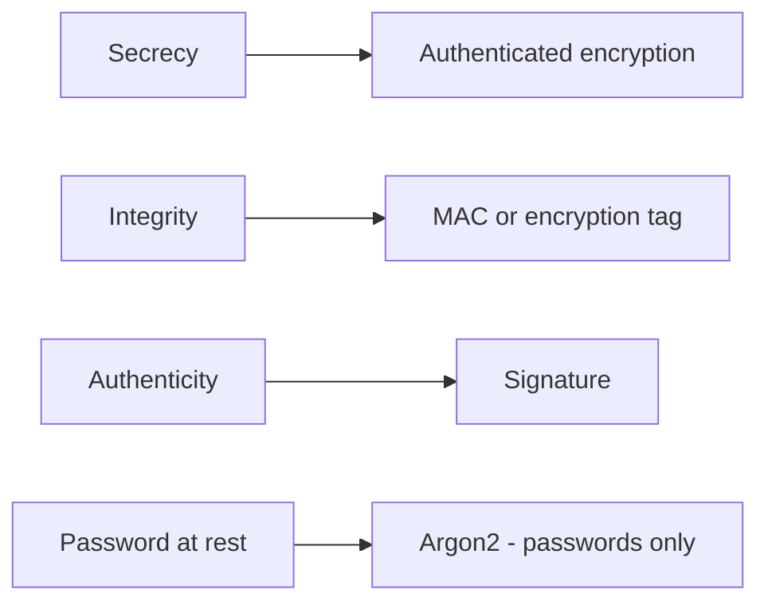

# Encoding is not secrecy

**Kind:** concept-model
**Loop step:** 1 Property

## The rule

The notes app stores a stand-in for a note body. Secrecy against someone who can read the stored field is not “we Base64ed it.” Encoding, hex, and rot13 reverse without a key. HTTPS encrypts the hop. It does not encrypt the column. Password hashing is a different rule for a different field.

> `protect("secret")` must not round-trip as Base64 of the plaintext. `looks_encrypted` is a teaching flag, not AES-GCM. The lab prefix `aesgcm:` is a **stand-in**, not a cipher you should ship.

What must not happen: **`protect()` reversible as Base64 to `secret`**. Anyone who can read the stored field gets the body. That is a secrecy failure of the stored note. Encoding is not confidentiality.

Use a real, reviewed encryption library, not encoding dressed up as encryption. Authenticated encryption (AES-GCM class), not ECB and not Base64. Password stretching (Argon2) is for passwords, not note bodies. Unique nonces and a post-quantum plan are advanced work, not this week's check. Keys still wait for a later lesson.

## Picture: encoding vs encryption



The person who can hurt you here is an operator who can read the column, or someone with a stolen disk of the lab dict. Trusting the column name `encrypted_body` is not what you trust.

**The tool (not the rule):** Fernet, libsodium, or “we turned on disk encryption.”

## Picture: pick the rule first



A stronger algorithm does not fix a missing key story (later) or nonce reuse (advanced, later).

## Why it happens, what it costs, how you stop it, how you notice, how you recover

| Slice | For this rule |
|---|---|
| Why it happens | The name “encrypted” was stuck on encoding |
| What has to be true first | `protect` returns Base64 of the plaintext |
| Trigger | Someone who can read storage reads the field |
| What it costs | The stored secret is no longer secret |
| How you stop it | Real authenticated encryption with a managed key; tests forbid Base64 identity |
| How you notice | Known-plaintext Base64 round-trip in CI |
| How you recover | Rotate keys; re-protect; treat it as a leak |

## What the framework does vs what you still have to check

Password libraries are for passwords, not note bodies. Disk encryption is not app-level secrecy against a database admin. The app's promise: Base64 decode of `protect("secret")` is not `"secret"`. The local check is `labs/5.2/5.2-lab`. Fake data only. No live key service.

## What the tool cannot do

- AES-GCM with a reused nonce is not this lab — name the misuse; do not paste attack scripts.
- Key sitting in the same row; “encryption” only on the client with the key in the download (later, phones).
- A JWT is a format (earlier), not encryption.

## Practice

Make a small table: rule vs algorithm vs what it is *not* for. Then run:

```text
python3 -m pytest labs/5.2/5.2-lab/tests --impl vulnerable
python3 -m pytest labs/5.2/5.2-lab/tests --impl fixed
```

## Use it somewhere new

A clinic example: an SSN column labeled “encrypted” that is Base64.

## What this page is not doing

Do not use live ciphertext attacks, rolling your own cipher, real SSN values. This site does not mark you as finished. Answer keys are not on this site.
