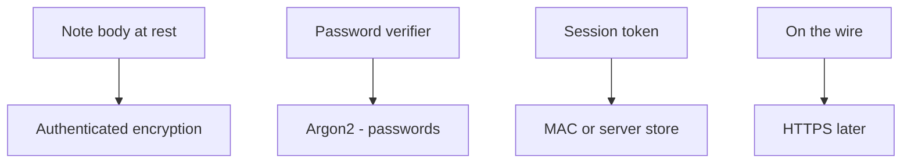
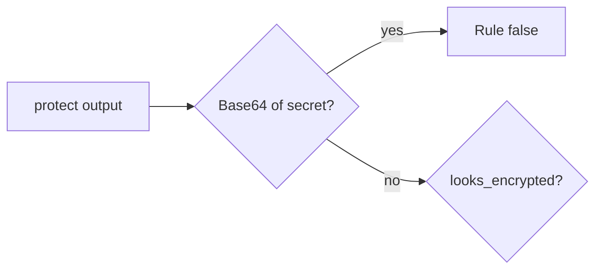

# A crypto decision table someone else can test

**Kind:** design-exercise
**Loop step:** 2 Model

## Could someone else name the checks from your table?

Keep **the rule**, **the field**, **the algorithm family**, and **what it is not for**; “We use AES” is not that list.

`protect` / `looks_encrypted` — Plaintext stand-in `secret`. No live key service.

> `protect("secret")` must not round-trip as Base64. If the table mixes rows, the wrong tool lands on the wrong field.

## Picture: four rows, four wrong tools

Using Argon2 on a note body, or Base64 on a password, mixes rows.

## Picture: the test is reversibility, not a product name

## Step 1: name the pieces

| Piece | This system |
|---|---|
| Who | Someone who can read storage; a developer who named the column encrypted |
| What | field `secret` at rest |
| Actions | `protect`; `looks_encrypted` |
| Paths | Database column stand-in |
| What you trust | An authenticated-encryption-shaped `protect`; keys later |
| What you do not trust | The column name; “HTTPS therefore encrypted” |
| Time | Stolen disk later |
| The rule | The stored body stays secret |

## Step 2: write allow and deny

| Who | What | Action | Decision |
|---|---|---|---|
| storage reader | Base64 field | recover plaintext | deny (must fail) |
| app | authenticated-encryption stand-in | store | allow if not reversible as Base64 |
| password path | note body | Argon2 | wrong row (named hole) |

A missing “storage reader × Base64 field × deny” row is how encoding gets sold as encryption. Write the hole.

## Practice

Look at `crypto.py` under `labs/5.2/5.2-lab`. Name field, tool, and the case that would prove the deny false. Fake data only.

## Use it somewhere new

Password hashing vs field encryption vs backup encryption. Three rows. Do not mix them.

## What can still go wrong

Memory dumps. Operators who are allowed to hold the key. Real keys wait for a later lesson.

## What this page is not doing

Do not put keys in lessons. Do not run this map against a public clinic. Answer keys are not on this site.
