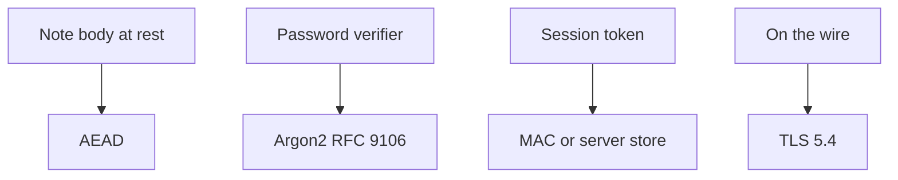
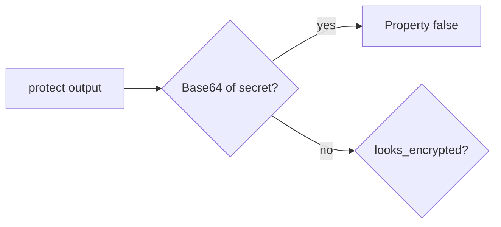

# 5.2-LO-02 — A crypto decision table a second engineer can test

**Kind:** design-exercise
**Loop step:** 2 Model
**Standards:** OWASP ASVS 5.0.0 (final) `v5.0.0-11.3.3`; RFC 9106 (final) for the password row only.

## Can a second engineer name pytest cases from your table?

“We use AES” is not this lesson. A reviewable model names **property, field, algorithm family, and what it is not**.

SecureCollab Phase 1 freeze: local `protect` / `looks_encrypted`. Plaintext stand-in `secret`. No live KMS.

## Mental model: four rows, four wrong tools

Using Argon2 on a note body, or Base64 on a password, mixes rows.

## Mental model: the test is reversibility, not a product name

## Step 1: freeze pieces

| Piece | This system |
|---|---|
| Subjects | storage observer; developer who named the column encrypted |
| Objects | field `secret` at rest |
| Actions | `protect`; `looks_encrypted` |
| Channels | DB column stand-in |
| TCB | AEAD-shaped protect; keys in 5.3 |
| Untrusted | Column name; “HTTPS therefore encrypted” |
| State / time | Stolen disk later |
| 1.1 cell | Confidentiality at rest |

## Step 2: write cells

| Subject | Object | Action | Decision |
|---|---|---|---|
| storage observer | Base64 field | recover plaintext | deny (must fail) |
| app | AEAD stand-in | store | allow if not reversible as Base64 |
| password path | note body | Argon2 | wrong row (named hole) |

## Practice

Draw the table. Point at `labs/5.2/5.2-lab` file `crypto.py`.

## Transfer

Password hashing vs field encryption vs backup encryption.

## Residual risk

Memory dumps; authorized operators; real AEAD keys (5.3).

## Non-goals

Top 10 as the definition of security. Keys stay out of lessons.
