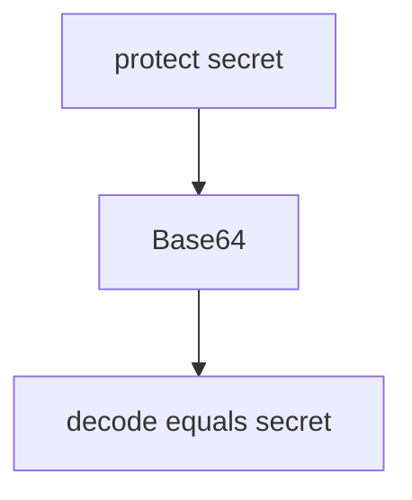

# 5.2-LO-03 — Observe Base64 labeled encryption, do not trophy a decoder

**Kind:** mechanism-lab
**Loop step:** 3 Break
**Standards:** OWASP ASVS 5.0.0 (final) `v5.0.0-11.3.3`.

## Authorized scope

`labs/5.2/5.2-lab` only. Synthetic plaintext `secret`. No live ciphertext.

**Forbidden outcome:** `protect()` is reversible as Base64 to `secret`.

## Mental model: reversible encoding



The vulnerable tree demonstrates **cause** (encoding named encryption), not a decoder script for production.

## What to read in the fixture

`vulnerable/crypto.py` `protect` Base64-encodes the string. Tests require that decoding does **not** yield `secret`, and that `looks_encrypted` is true on the fixed stand-in.

## Root cause vs impact

| Slice | Lab |
|---|---|
| Root cause | Encoding labeled encryption |
| Impact | Any column reader gets the secret |
| Not the lesson | A cipher product name as the definition |

## Practice

```
python3 -m pytest labs/5.2/5.2-lab/tests --impl vulnerable
```

Record `test_protect_is_not_mere_encoding`. Do not add a live decoder against other hosts.

## Transfer

Clinic SSN column. Predict without leaving this directory.

## Non-goals

No live-target instructions. Synthetic data only.
