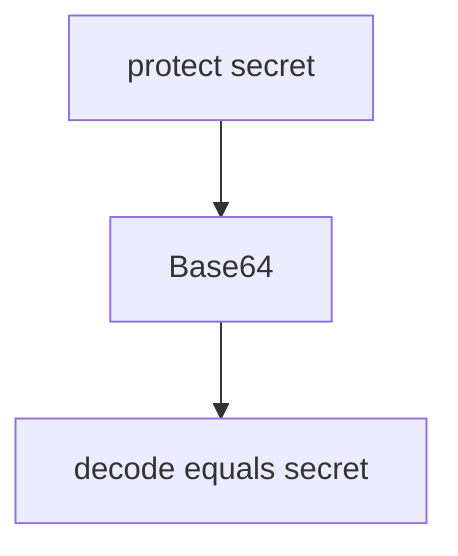

# Practice: protect is reversible as Base64

**Kind:** mechanism-lab
**Loop step:** 3 Break

## Try it

The practice is not a website you attack. `protect` / `looks_encrypted` uses fake plaintext `secret`. It does not open a database or a cipher library. Base64 labeled as encryption is the break; do not decode live data.

> `protect("secret")` must not round-trip as Base64 of the plaintext. If `base64.b64decode(protect("secret"))` equals `"secret"`, encoding was sold as secrecy.

## Where you may practice

Stay inside `labs/5.2/5.2-lab`. Restore the broken and repaired folders when you are done. Fake plaintext `secret` only.

Do not decode a live column. Do not decode an employer backup. Do not decode a classmate dump. Do not “just try Base64” on someone else's file.

What must not happen: `protect()` is reversible as Base64 to `secret`.

Picture an honest storage reader — a database admin, a stolen disk, a backup tape — who can read the column — a clinic SSN column named `ssn_encrypted` that is still encoding. `protect` is not reversible as encoding. HTTPS, volume encryption, a column rename, and “we use AES” in a README are not enough.

## Picture: reversible encoding



Encoding is named encryption — not a decoder script for production. `protect` returns `base64.b64encode(p)`; `looks_encrypted` is `t != "secret"`. You do not need a live column. You must not decode one.

Use approved authenticated encryption, not encoding. Argon2 is for **passwords**, not this field.

## What to look at: the cause, not a hunt

In `vulnerable/crypto.py`, `protect` Base64-encodes the string. Tests:

- `test_protect_is_not_mere_encoding`
- `test_protect_does_not_return_plaintext`


| What you see | What kind of failure | Not the lesson |
|---|---|---|
| `protect` returns Base64 | Encoding labeled encryption | “The bytes look scrambled” |
| Decode equals `secret` | Reversible without a key | A cipher product name |
| `looks_encrypted` is `t != "secret"` | Teaching flag on encoding | HTTPS or a live decoder |

## Why it happens vs what it costs

| Slice | Practice |
|---|---|
| Required rule | Stored value is not Base64 of the plaintext |
| Why it happens | Encoding labeled encryption |
| What's already wrong | `protect` returns Base64; decode equals `secret` |
| Trigger | `protect("secret")` then Base64 decode |
| What it costs | The body is readable to any column reader |
| How you stop it later | Authenticated encryption with a managed key; refuse encoding as `protect` |
| How you notice later | Known-plaintext Base64 round-trip in CI |
| How you recover later | Re-protect with real encryption; rotate keys later |
| Out of scope | A cipher product name, HTTPS, or a live decoder |

Postgres `bytea` is not authenticated encryption. FastAPI will store whatever string you hand it. Next.js does not encrypt the column. Base64 decode of `protect("secret")` is not `"secret"`.

## Practice

```text
python3 -m pytest labs/5.2/5.2-lab/tests --impl vulnerable
```

Record the failing test `test_protect_is_not_mere_encoding`. Do not add a live decoder against other hosts. A setup error is not proof the rule holds.

## Use it somewhere new

Clinic SSN column labeled `ssn_encrypted`. Predict, without leaving this directory, whether the label keeps the number secret. Do not query a live clinic system.

## What this page is not doing

No live-target instructions. Synthetic plaintext only. Do not “fix” the practice by deleting the test.
