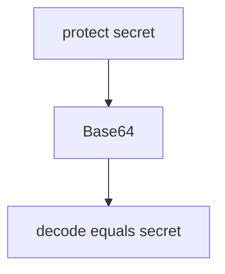

# 5.2-LO-03 — Observe Base64 labeled encryption, do not trophy a decoder

**Kind:** mechanism-lab
**Loop step:** 3 Break
**Standards:** OWASP ASVS 5.0.0 (final) `v5.0.0-11.3.3`. `v5.0.0-11.3.4` (nonce uniqueness) is **Level 3, advanced**, not this pytest.

## Authorized scope

`labs/5.2/5.2-lab` only. The fixture is an in-process `protect` / `looks_encrypted`. Synthetic plaintext `secret`. It does not open a database or a cipher library. Do not decode a live column, an employer backup, or a classmate dump as this exercise.

**Forbidden outcome:** `protect()` is reversible as Base64 to `secret`. `base64.b64decode(protect("secret"))` equals `"secret"`.

Attacker capability in this lab: an honest storage observer — DBA, stolen disk, backup tape — who can read the column. That stands in for a clinic SSN column named `ssn_encrypted` that is still encoding. Trust assumption: `protect` is supposed to be irreversible as encoding. HTTPS, volume encryption, a column rename, and “we use AES” in a README are not in the TCB for this cell.

## Mental model: reversible encoding



The vulnerable tree demonstrates **cause** (encoding named encryption), not a decoder script for production. Preconditions: `protect` returns `base64.b64encode(p)`; `looks_encrypted` is `t != "secret"`. You do not need a live column. You must not decode one.

ASVS `v5.0.0-11.3.3` wants approved AEAD, not encoding. RFC 9106 Argon2 is for **passwords**, not this field.

## What to read in the fixture

`vulnerable/crypto.py` `protect` Base64-encodes the string. Tests:

- `test_protect_is_not_mere_encoding`
- `test_protect_does_not_return_plaintext`

You do not need a new cipher name. The failure of `test_protect_is_not_mere_encoding` *is* the evidence.

Do not open the fixed tree yet. Diagnose the cause first.

## Root cause vs impact vs prevention vs detection vs recovery

| Slice | This lab |
|---|---|
| Required property | Stored value is not Base64 of the plaintext |
| Root cause | Encoding labeled encryption |
| Preconditions | `protect` returns Base64; decode equals `secret` |
| Trigger | `protect("secret")` then Base64 decode |
| Impact | Confidentiality of the body vs any column reader |
| Prevention | AEAD with a managed key (5.3); refuse encoding as `protect` |
| Detection | Known-plaintext Base64 round-trip in CI |
| Recovery | Re-protect with AEAD; rotate keys (5.3) |
| Not the lesson | A cipher product name, HTTPS, or a live decoder |

## Framework defaults versus the confidentiality guarantee

Postgres `bytea` is not AEAD. FastAPI will store whatever string you hand it. Next.js does not encrypt the column. The application guarantee is: **this** fixture, Base64 decode of `protect("secret")` is not `"secret"`.

## Practice

```text
python3 -m pytest labs/5.2/5.2-lab/tests --impl vulnerable
```

Record `test_protect_is_not_mere_encoding`. Do not add a live decoder against other hosts. An environment error is not security evidence.

## Transfer

Clinic SSN column labeled `ssn_encrypted`. Predict without leaving this directory. Do not query a live EHR.

## Non-goals

No live-target instructions. Synthetic plaintext only.
