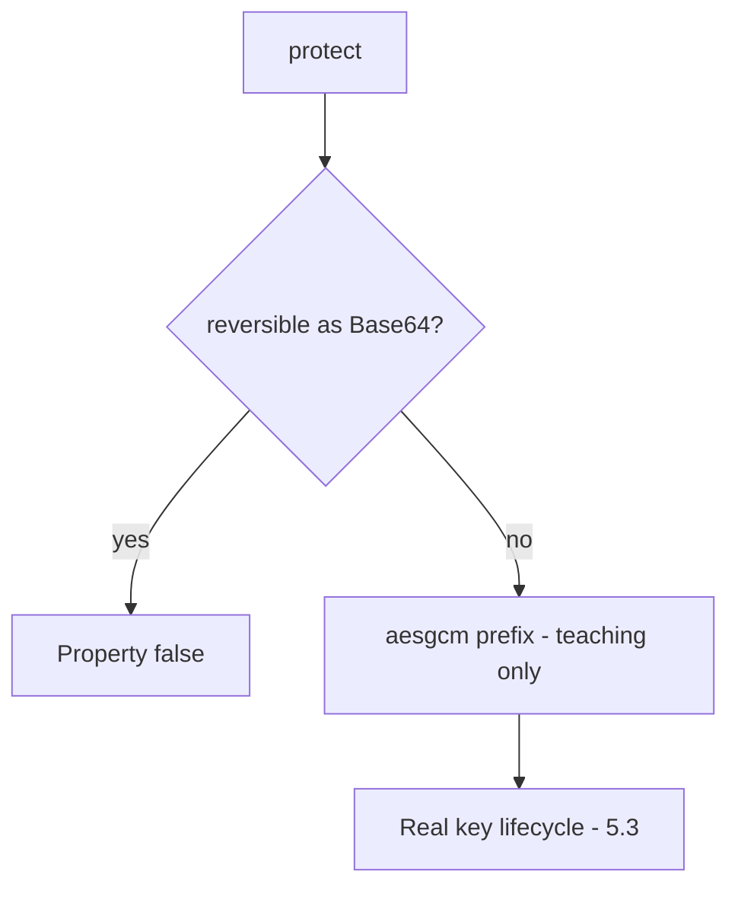

# 5.2-LO-04 — Refuse encoding as the confidentiality mechanism

**Kind:** design-exercise
**Loop step:** 4 Build
**Standards:** OWASP ASVS 5.0.0 (final) `v5.0.0-11.2.1` and `v5.0.0-11.3.3`.

## Structural means the stored value is not reversible as encoding

`protect` must not be Base64 of the plaintext. The lab’s `aesgcm:` prefix is a **teaching flag** that `looks_encrypted` can assert — not a cipher to copy into FastAPI.

## Mental model: stand-in, then a real AEAD in 5.3



Fail-safe: if the AEAD library or key is missing, **do not store plaintext** (refuse write).

## Why this restores the cell

| After the fix | Must be true |
|---|---|
| `protect("secret")` | not equal to `secret` |
| Base64 decode | not equal to `secret` |
| `looks_encrypted` | true on the stand-in |

## What this is not

Volume encryption. HTTPS. Argon2 on a note body. JWT. ECB “because we need deterministic.”

## Practice

Name property and predicate. Run:

```
python3 -m pytest labs/5.2/5.2-lab/tests --impl fixed
```

Must pass.

## Transfer

Clinic: replace Base64 column with AEAD and a managed key (5.3).

## Residual risk

Nonce reuse (`v5.0.0-11.3.4` Level 3 advanced); key in the same row.
