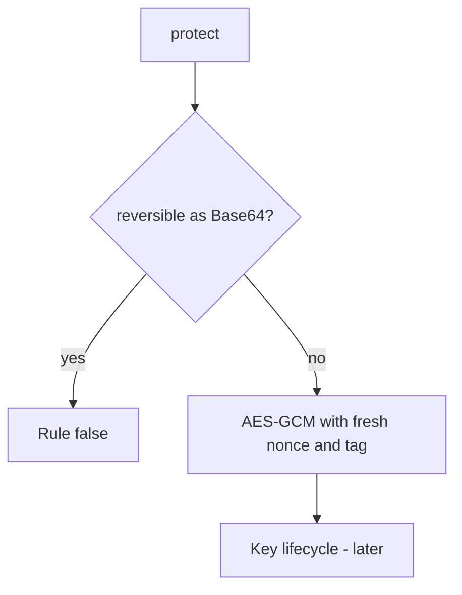

# Build authenticated encryption, not a label

**Kind:** design-exercise
**Loop step:** 4 Build

## The rule

A column rename does not encrypt the body. HTTPS is a hop. Volume encryption is the disk. Banning the word “base64” in the function name is not `protect("secret")`.

Repair this: the stored value is **not reversible as encoding**. Here: a keyed transform the storage reader cannot invert — not a prettier name.

Repair a body stand-in with a real primitive: `protect` uses AES-GCM, creates a fresh nonce, keeps the synthetic key outside the stored value, and returns the nonce plus ciphertext and tag. `unprotect` authenticates before releasing plaintext, and malformed or tampered input fails closed. By default, if the encryption library or the key is missing, **do not store plaintext** (refuse the write).

## Picture: real primitive now, lifecycle later



The fixed value has an `aesgcm:v1:` envelope, but the prefix is only a format marker. The security comes from AES-GCM authentication and confidentiality, not from the label. The reviewed library still needs a key that is not in the same row. Argon2 on a note body is the wrong rule. A JWT is not encryption.

Use approved authenticated encryption. The check is not only “the output is not encoding”; it is also “the intended plaintext round-trips, repeated plaintext gets a fresh nonce, and modified bytes are rejected.”

## What the repaired files must show

`fixed/crypto.py` is the protect helper, not a live SSN cipher.

| After the fix | Must be true |
|---|---|
| `protect("secret")` | not equal to `secret` or its Base64 encoding |
| `unprotect(protect("secret"))` | returns `secret` |
| repeated `protect("secret")` | different protected values because the nonce is fresh |
| modified protected value | rejected by the authentication tag |
| `looks_encrypted` | true only for a value this fixture can authenticate |

If you cannot encrypt, refuse the write. The dashboard still showing “encrypted” is not a store.

## What this is not

Volume encryption. HTTPS. Argon2 on a note body. JWT. ECB “because we need it deterministic.” A cipher name or prefix in a README. Disk encryption as the column control.

## What the tool cannot do

- The `aesgcm:v1:` prefix identifies the fixture format; it is not what supplies security.
- The process-local synthetic key is not a production key store; key separation and rotation wait for 5.3.
- Nonce reuse is tested here as a repeated-plaintext property; multi-process nonce coordination remains a residual.
- TLS does not encrypt the column.
- Password hashing is a different field.

## Practice

Name the rule and the check (not Base64 of plaintext, and the teaching flag). Run:

```text
python3 -m pytest labs/5.2/5.2-lab/tests --impl fixed
```

## Use it somewhere new

Replace a Base64 column with authenticated encryption and a managed key, not a rename to `ssn_encrypted`.

## What can still go wrong

Key reuse across deployments. Key in the same row. The fixture mistaken for a complete production design. Operators who are allowed to hold the key.

## What this page is not doing

Do not copy the fixture's process-local key or envelope assumptions into production. A cipher product name does not finish a check-in.
