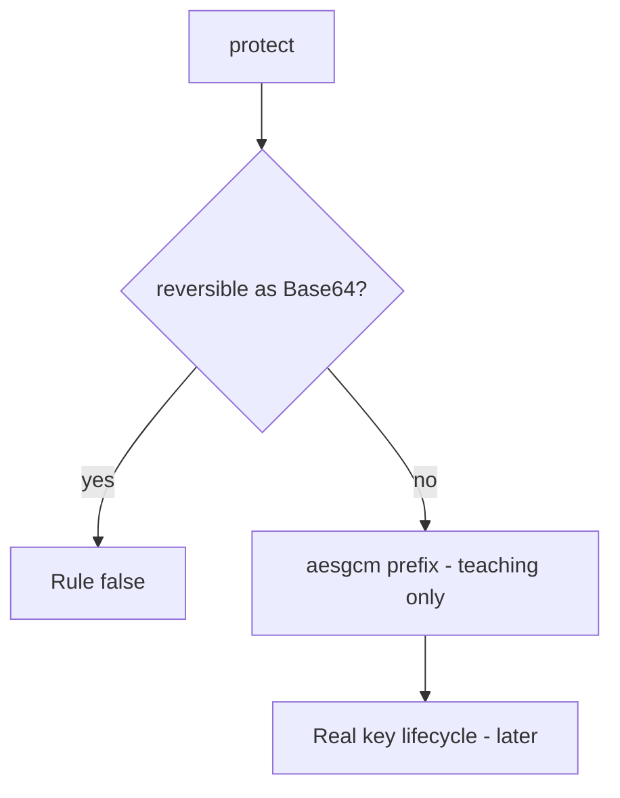

# Refuse encoding as the secrecy tool

**Kind:** design-exercise
**Loop step:** 4 Build

## The rule

A column rename does not encrypt the body. HTTPS is a hop. Volume encryption is the disk. Banning the word “base64” in the function name is not `protect("secret")`.

Repair this: the stored value is **not reversible as encoding**. Here: a keyed transform the storage reader cannot invert — not a prettier name.

Repair a body stand-in: `protect` returns a value that does not round-trip as Base64, and `looks_encrypted` asserts a teaching flag. The lab prefix `aesgcm:` is a **teaching flag** that `looks_encrypted` can assert — not a cipher to copy into FastAPI. Fail closed: if the encryption library or the key is missing, **do not store plaintext** (refuse the write).

## Picture: stand-in now, real keys later



The prefix is `aesgcm:` plus length. A reviewed authenticated-encryption library still needs a key that is not in the same row. Argon2 on a note body is the wrong rule. A JWT is not encryption.

Use approved authenticated encryption. The check is “not encoding,” not “we shipped AES-GCM.”

## What the repaired files must show

Do not treat `fixed/crypto.py` as a production cipher.

| After the fix | Must be true |
|---|---|
| `protect("secret")` | not equal to `secret` |
| Base64 decode | not equal to `secret` |
| `looks_encrypted` | true on the stand-in |

Fail closed: if you cannot encrypt, the answer is refuse the write. Uncertainty is a **deny**, not a yes because the dashboard still showed “encrypted.”

## What this is not

Volume encryption. HTTPS. Argon2 on a note body. JWT. ECB “because we need it deterministic.” A cipher name in a README. Disk encryption as the column control.

## What the tool cannot do

- The `aesgcm:` prefix is a stand-in, not AES-GCM.
- Key in the same row, or a hardcoded key, waits for a later lesson.
- Nonce reuse is advanced work, not this practice.
- TLS does not encrypt the column.
- Password hashing is a different field.

## Practice

Name the rule and the check (not Base64 of plaintext, and the teaching flag). Run:

```text
python3 -m pytest labs/5.2/5.2-lab/tests --impl fixed
```

## Use it somewhere new

Replace a Base64 column with authenticated encryption and a managed key, not a rename to `ssn_encrypted`.

## What can still go wrong

Nonce reuse. Key in the same row. The stand-in mistaken for a shipped cipher. Operators who are allowed to hold the key.

## What this page is not doing

Do not copy the teaching prefix into production. Do not claim a course gate from a cipher product name.
