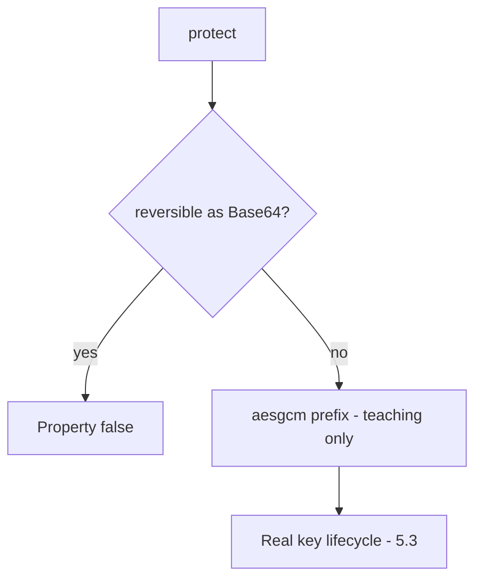

# 5.2-LO-04 — Refuse encoding as the confidentiality mechanism

**Kind:** design-exercise
**Loop step:** 4 Build
**Standards:** OWASP ASVS 5.0.0 (final) `v5.0.0-11.2.1` and `v5.0.0-11.3.3`. `v5.0.0-11.3.4` and `v5.0.0-11.1.4` (PQC plan) are **Level 3, advanced**.

## Structural means the stored value is not reversible as encoding

`protect` must not be Base64 of the plaintext. Structural means a keyed transform the storage observer cannot invert — not a denylist of “base64” in the function name, not a column rename, not HTTPS, not volume encryption.

The smallest restore for SecureCollab Phase 1 note-body stand-in is: `protect` returns a value that does not round-trip as Base64, and `looks_encrypted` asserts a teaching flag. The lab’s `aesgcm:` prefix is a **teaching flag** that `looks_encrypted` can assert — not a cipher to copy into FastAPI. Fail-safe: if the AEAD library or key is missing, **do not store plaintext** (refuse write).

## Mental model: stand-in, then a real AEAD in 5.3



The lab’s fixed tree prefixes `aesgcm:` plus length. Production still needs a validated AEAD (`v5.0.0-11.2.1`) and a key that is not in the same row (5.3). Argon2 on a note body is the wrong property. JWT is not encryption.

ASVS `v5.0.0-11.3.3` wants approved AEAD. This pytest is “not encoding,” not “we shipped AES-GCM.”

## Why this restores the cell

| After the fix | Must be true |
|---|---|
| `protect("secret")` | not equal to `secret` |
| Base64 decode | not equal to `secret` |
| `looks_encrypted` | true on the stand-in |

## What this is not

Volume encryption. HTTPS. Argon2 on a note body. JWT. ECB “because we need deterministic.” A cipher name in a README. Disk encryption as the column control.

## Mechanism limits

- The `aesgcm:` prefix is a stand-in, not AES-GCM.
- Key in the same row, or a hardcoded key, waits for 5.3.
- Nonce reuse (`v5.0.0-11.3.4` Level 3 advanced) is not this fixture.
- TLS (5.4) does not encrypt the column.
- Password hashing (RFC 9106) is a different field.

## Practice

Name property and predicate (not Base64 of plaintext ∧ teaching flag). Run:

```text
python3 -m pytest labs/5.2/5.2-lab/tests --impl fixed
```

Must pass.

## Transfer

Clinic: replace Base64 column with AEAD and a managed key (5.3), not a rename to `ssn_encrypted`.

## Residual risk

Nonce reuse; key in the same row; stand-in mistaken for a shipped cipher; authorized operators who hold the key.

## Non-goals

Do not copy the teaching prefix into production. Do not claim Gate 5 from a cipher product name.
