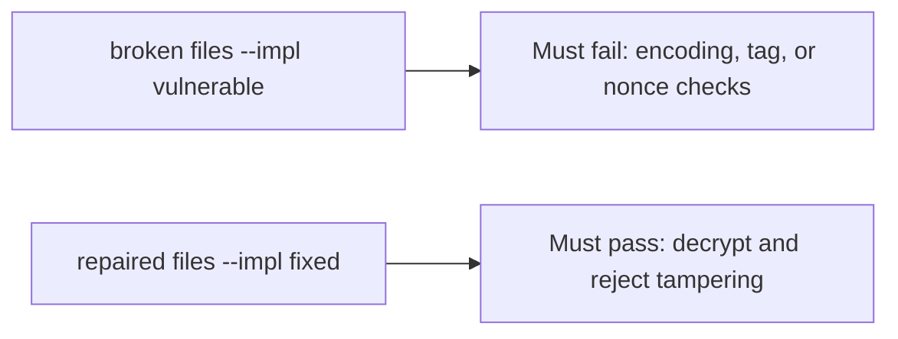

# Verify confidentiality and integrity, not a product name

**Kind:** verification-lab
**Loop step:** 5 Verify

## Check it

Naming AES in a comment does not encrypt the body. A `bytea` column type is storage. Base64 decode of `protect("secret")` must not be `"secret"`; the intended plaintext must round-trip through authenticated decryption; and tampering must be rejected. Broken: the value is reversible or accepts a modified tag. Repair keeps the body confidential and refuses an unauthenticated value.

## Picture: multiple property oracles must agree

A green tally of passing tests is not the Base64 check. The failing observation on the broken files is **Base64 round-trip**.



If the broken protect still passes, you never decoded `protect("secret")` as Base64.

## What the check has to show

| Mode | Must show for this topic |
|---|---|
| Normal | Output is not plaintext; intended plaintext decrypts with valid authentication |
| Wrong input / abuse | Base64 of `secret` is rejected; broken files must fail |
| Abuse | A changed ciphertext or tag is rejected; repeated plaintext receives different nonces |
| Failure | If the library or key is missing, refuse the write — do not store plaintext |
| Not claimed | Production key storage, rotation, backup re-encryption, or distributed nonce coordination |

`test_protect_is_not_mere_encoding` stays red on reversible encoding. The round-trip, fresh-nonce, tamper, and malformed-value tests prevent the repaired path from passing on a prefix alone.

An `AES` comment is not a decode of `protect("secret")`. This practice never opens a live column.

```text
python3 -m pytest labs/5.2/5.2-lab/tests --impl vulnerable
python3 -m pytest labs/5.2/5.2-lab/tests --impl fixed
```

Do not let `test_protect_does_not_return_plaintext` hide the leftover. Fail a round-trip decode and a tamper attempt. If the broken files do not fail the intended property tests, the lab is miswired — fix the wiring, not the assertion. A setup error is not proof the rule holds.

## What the tests do not prove

- Key lifecycle (later)
- TLS (later)
- A post-quantum plan (advanced; not this check)
- Nonce uniqueness (advanced; not this check)
- A production key-management or deployment design

## Practice

Run the full pair. Explain why a fresh nonce, authentication tag, and key boundary matter. An `AES` comment is a name, not ciphertext.

## Use it somewhere new

A non-null SSN column is not secrecy evidence. Do not run a test that decodes a live clinic column.

## What this page is not doing

Do not add a live decoder. Do not log plaintext `secret`. Keys stay out of this file.
